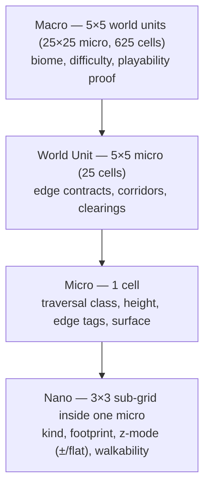
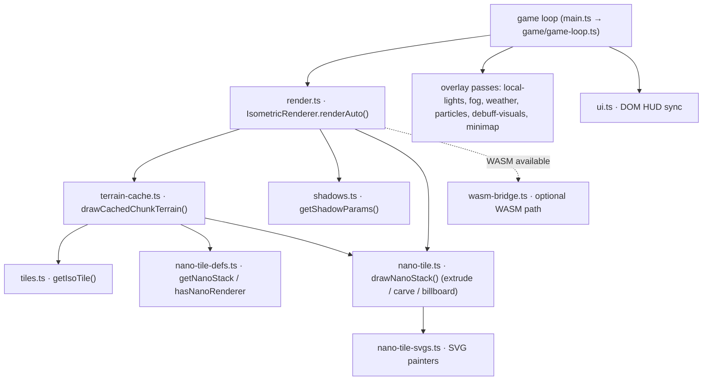

# Emily's Game — Engine Architecture

**Status:** Living document · **Owner EPIC:** #247 · **Issue:** #250 (A1)
**Last updated:** 2026-06-11 · **Branch:** `refactor/engine-phase1`

> This is the canonical architectural reference for Emily's Game. Read this plus
> [AGENTS.md](../AGENTS.md) before touching engine code. Companion documents:
> [EngineDecompositionMap.md](EngineDecompositionMap.md) (file-by-file split plan, #249)
> and [RefactoringPlan_11-06-26.md](RefactoringPlan_11-06-26.md) (the phased plan).

---

## 1. What Emily's Game is

A procedurally generated, educational, **isometric** browser adventure built
**from scratch** in TypeScript + HTML5 Canvas 2D (no game engine, no heavy libs),
bundled with Vite. World generation is biased by LLM-derived entropy; progression
is gated by educational quizzes; the world is organized into lazily-loaded chunks.

Core constraints (do not violate without an explicit decision):

- **Canvas 2D** is the primary renderer (WebGL/WASM are optional accelerators).
- **HTML DOM** for all UI (not canvas-drawn UI).
- **No external game engine**; everything is hand-rolled.
- **Zero-allocation render hot path**; viewport-culled; chunk-cached.
- **Deterministic generation**: a chunk is regenerated from its seed on re-entry,
  not stored — so identical seed → identical chunk is load-bearing for save/load.

---

## 2. Current state (June 2026)

`src/` is **flat** (~75 `.ts` files) except for `src/config/` and `src/types/`.
Two god-files dominate:

- `src/main.ts` (**3316 lines**) — entry point + per-frame orchestration of ~20
  concerns; exposes ~80–90 `window.__gameDebug` accessors.
- `src/gen.ts` (**2558 lines**) — world generation monolith implementing a partial
  version of the WorldEngine solver pipeline.

There is no enforced layering: rendering, generation, gameplay, UI, and asset
generation all live side-by-side at `src/` root. This document defines the target
layering; Phase B (#251–#254) executes the move.

See [EngineDecompositionMap.md](EngineDecompositionMap.md) for the complete list of
files > 400 lines with measured line counts and per-file split plans.

---

## 3. Target layered structure

```
src/
├── engine/          # PURE logic — no DOM, no Canvas, no window
│   ├── world/       # gen.ts split: BiomeSelector, TemplateStamper, Populator,
│   │                #   CollectibleScatterer, ObstacleSolver, Validation, Entropy, index
│   ├── iso2-solver.ts        # nano footprint walkability / collision
│   ├── mechanics.ts          # interaction, collision, autocollect
│   ├── llm.ts                # LLM client, health, entropy expansion
│   ├── utils.ts / math       # hash, RNG, BFS
│   └── math.ts / constants
├── rendering/       # ALL Canvas drawing + isometric projection
│   ├── render.ts             # IsometricRenderer, Camera consumer, draw pool, depth sort
│   ├── terrain-cache.ts      # per-chunk baked terrain canvases
│   ├── nano-tile.ts          # Z-pinned nano draw pipeline (extrude / carve / billboard)
│   ├── nano-tile-defs.ts     # nano stack registry + renderer dispatch
│   ├── nano-tile-svgs.ts     # nano SVG painters
│   ├── tiles.ts              # base terrain tile SVG + iso transform
│   ├── local-lights.ts, shadows.ts, fog.ts, lighting.ts, weather.ts
│   ├── particles.ts, debuff-visuals.ts, minimap.ts
│   └── wasm-bridge.ts        # optional WASM renderer integration
├── asset-pipeline/  # procedural sprite + texture generation
│   ├── sprites.ts, asset-sprites.ts, npc-sprites.ts, emoji-cache.ts
│   ├── iso2-materials.ts     # face-slice structural materials
│   └── asset-library.ts, content-loader.ts
├── game/            # systems + orchestration (extracted from main.ts)
│   ├── bootstrap.ts, game-loop.ts, input-wiring.ts, interactions.ts
│   ├── save-wiring.ts, systems-orchestrator.ts, debug-hooks.ts, game-state.ts
│   ├── input.ts, quiz.ts, math-solver.ts, trading.ts, inventory.ts
│   ├── status.ts, injury.ts, knowledge.ts, wildlife.ts, save.ts
│   ├── age-profile.ts, tutorial.ts, platform.ts
│   └── audio/        # sfx.ts, music.ts, sampled-sfx.ts, midi-loader.ts, npc-voice.ts
├── ui/              # HUD, menus, overlays, DOM sync
│   ├── ui.ts, menus.ts, customizer.ts, thought-bubbles.ts, markdown.ts
│   └── book-content.ts
├── config/          # (unchanged) immutable, typed *.config.ts data
├── types/           # shared cross-boundary types (Camera, world, interaction, ...)
└── main.ts          # thin bootstrap entry (< 400 lines target)
```

### Layering rules

1. `engine/` must not import from `rendering/`, `ui/`, or touch `document`/`window`/Canvas.
2. `rendering/` owns the Canvas. It may import from `engine/` and `asset-pipeline/`.
3. `asset-pipeline/` produces images/SVGs; it does not drive the frame loop.
4. `game/` orchestrates everything and owns the `GameState` object.
5. `ui/` reads game state and renders DOM; it does not mutate world/render internals directly.
6. **Data ≠ rendering.** A tile's logical data (walkability, height, kind) lives in
   `engine/`; how it is drawn lives in `rendering/`.
7. Shared types that cross two or more layers live in `src/types/` (see §7).

> **Folder case:** `kebab-case` file names (existing convention), `PascalCase` for the
> extracted `engine/world/` phase modules (they are conceptual "solvers"/services).
> Decided once here; see [AGENTS.md](../AGENTS.md) for the full naming standard.

---

## 4. Spatial hierarchy (four tiers)

From [WorldEngine-01-SpatialHierarchy.md](WorldEngine-01-SpatialHierarchy.md):



The **Nano** tier is the precision layer: it adds an addressable 3×3 sub-grid inside
a micro **without** increasing the outer XY footprint, enabling sub-micro features
(fence on a west edge, bridge through a center, wall corner variant) and sub-cell
walkability. Nanos resolve into four render families:

| Family | Behavior | Examples |
|--------|----------|----------|
| Positive-Z billboard | upright, Z-pinned skew | fence, gate, tall-grass |
| Positive-Z extruded | solid 3-face box | stone-wall, cathedral-wall, homestead-wall |
| Negative-Z carve-out | sunken channel below ground plane | river, river-bank |
| Flat overlay | ground-hugging decal | trims, decals |

**Player anchor convention** ([Iso2.0-PlayerAnchorConvention.md](Iso2.0-PlayerAnchorConvention.md)):
the player anchors at the **center of a nano cell**:
`foot = (col + (nanoCol+0.5)/3, row + (nanoRow+0.5)/3)`; depth sort uses the same
foot coords. Falls back to the micro south-vertex if nano coords are omitted.

---

## 5. Rendering pipeline

`render.ts` is the core terrain + object renderer. Per-frame overlay passes
(lights, fog, weather, particles, minimap, DOM UI) are orchestrated from `main.ts`'s
render section (≈ lines 3152–3250 today; moves to `game/game-loop.ts` in B2).



**Hot-path rules** (`rendering.instructions.md`, `performance.instructions.md`):

- Pre-allocated draw-command pool (`jsPool`, 8192) + sort index — no per-frame allocs.
- Viewport culling: only chunks within camera view ± margin are drawn.
- Per-chunk terrain is baked to an offscreen canvas and reused until invalidated.
- SVG images decode once into an `HTMLImageElement` cache; nano stacks are cached.
- Throttle `animFrame` ticks and DOM syncs (not every rAF).

---

## 6. Generation pipeline

`gen.ts`'s `generateChunkSync()` is called when the player crosses a chunk boundary.
It implements a partial version of the 10-phase
[WorldEngine solver pipeline](WorldEngine-03-SolverPipeline.md):

| Phase | Status | Where (gen.ts today → engine/world/ target) |
|-------|--------|---------------------------------------------|
| Entropy harvest / biome+mood select | ✅ implemented | `selectBiomeCoherent`, `deriveMood` → `BiomeSelector.ts`, `Entropy.ts` |
| 1 Perlin base terrain | ✅ | `buildPerlinBase` → `TemplateStamper.ts` |
| 2 AC-3 world-unit grid solve | ✅ | `solveWorldUnitGrid` + AC-3 → `TemplateStamper.ts` |
| 3 Stamp grid | ✅ | `stampWorldUnitGrid` → `TemplateStamper.ts` |
| 3b Boundary collection (cross-chunk) | ⚠️ partial | `applyBorderConstraints` (not fully enforced) |
| 4 Passability | ✅ | `enforcePassability`, water integrity → `Passability.ts` |
| 5 Population / decorations / collectibles | ✅ | `populateAnchors`, `cluster/scatterDecorations`, `scatterCollectibles`, `layCoinTrails` → `Populator.ts`, `CollectibleScatterer.ts` |
| 5.4 Quiz gates / fence-run gates | ✅ | `placeQuizGates`, `placeGatesInFenceRuns` → `ObstacleSolver.ts` |
| 6 Chain integrity (edge contracts) | ❌ planned | — |
| 7 Progression placement (lock-key DAG) | ⚠️ partial | balance/repair + `getLockKeyDebugInfo` → `ObstacleSolver.ts` |
| 8 Playability validation (Solver F) | ✅ | `validatePlayability`, `getPlayabilityStats` → `Validation.ts` |
| 9–10 (full edge contracts, macro assembly) | ❌ planned | — |

**Determinism:** generation is seeded; chunks are **not** persisted — they regenerate
identically on re-entry. The B3 split (#253) must preserve this exactly (covered by a
determinism test).

---

## 7. State & save model

- A single monolithic `GameState` object is created in `main.ts` (interface at
  lines 148–290; moves to `src/types/game-state.ts` + a `game/game-state.ts` factory
  in B2). It threads through `update()`, `render()`, interactions, and save/load.
- `save.ts` serializes a reduced form to `localStorage` (player, inventory, quiz
  streak, knowledge, status, injury, customization, cosmetics, visited cells, entropy
  buffer, playtime). Chunks are **regenerated**, not stored.

### Module-level mutable state (anti-pattern — B4 #254 classifies each)

| Location | State | Classification |
|----------|-------|----------------|
| `gen.ts` | `_wordlist`, entropy pool, DAG accumulators | move to engine service / state |
| `render.ts` | mouth/head-bob anim (`_dialogNpcId`…), draw `jsPool`, `occluderPool`, `objectCellCache` | **owned cache** (keep in module), animation may move to `npc-dialog-anim.ts` |
| `local-lights.ts` | `_lights` | owned service |
| `fog.ts` | `_visited` grid | serialized state (already saved) |
| `weather.ts` | `_current` | ephemeral owned state |
| `terrain-cache.ts` | `_terrainCache`, `_objectCache` Maps | owned cache |

**Rule going forward:** state that must persist across save/load belongs in
`GameState`; ephemeral render/generation caches are explicitly owned by their module
and documented here. No new ad-hoc module-level mutable globals.

### Shared types (centralize in `src/types/`)

`Camera` is currently **duplicated** (`render.ts:30` and `local-lights.ts:47`) — B4
promotes a single canonical `Camera` to `src/types/camera.types.ts`. Other
cross-boundary types to centralize: `ChunkData`/`BorderConstraints` (from `gen.ts`),
`InteractionResult` (from `mechanics.ts`). Module-internal types stay in-file.

---

## 8. Tooling & visual validation

Visual/asset work in the Iso 2.0 experiment uses the **`isoSvgRenderer` MCP** tools
(`render_game_tile`, `render_nano_assembly`, `render_iso_scene`, etc.) for fast,
zero-browser iteration; see `.github/instructions/isosvgrenderer.instructions.md`.
A canonical `VisualTestSuite` + `npm run visual-test` is defined in D1 (#259).

Mandatory pre-commit checks: `npx tsc --noEmit` (root **and**
`experiment/isometric-2.0`), `npx playwright test`, and (after D1) `npm run visual-test`.

---

## 9. Files > 400 lines (responsibility index)

Full split plan in [EngineDecompositionMap.md](EngineDecompositionMap.md). Summary:

| File | Lines | Primary responsibility | Target layer |
|------|------:|------------------------|--------------|
| `main.ts` | 3316 | entry + per-frame orchestration (~20 concerns) | `src/` + `game/` |
| `gen.ts` | 2558 | world generation (solver pipeline) | `engine/world/` |
| `config/tiles.config.ts` | 2381 | tile metadata, templates, biome palettes, edge contracts | `config/` |
| `asset-sprites.ts` | 1092 | SVG asset factory (60+ assets, fire frames) | `asset-pipeline/` |
| `nano-tile.ts` | 1030 | Z-pinned nano draw pipeline | `rendering/` |
| `render.ts` | 870 | isometric renderer, draw pool, depth sort | `rendering/` |
| `sprites.ts` | 837 | procedural character sprite generation | `asset-pipeline/` |
| `terrain-cache.ts` | 749 | per-chunk baked terrain | `rendering/` |
| `ui.ts` | 734 | HUD/DOM sync, dialog, debug panels | `ui/` |
| `tiles.ts` | 661 | base tile SVG + iso transform | `rendering/` |
| `sfx.ts` | 621 | WebAudio sound effects | `game/audio/` |
| `wildlife.ts` | 579 | animal spawning/behavior/discovery | `game/` |
| `input.ts` | 522 | input manager, edge detection | `game/` |
| `config/assets.config.ts` | 493 | asset defs, obstacle templates | `config/` |
| `knowledge.ts` | 479 | Book of Knowledge | `game/` |
| `trading.ts` | 470 | NPC trading + barter quiz | `game/` |
| `npc-sprites.ts` | 445 | paper-cut NPC sprites | `asset-pipeline/` |
| `nano-tile-svgs.ts` | 439 | nano SVG painters | `rendering/` |
| `local-lights.ts` | 430 | point/flashlight rendering | `rendering/` |
| `config/npc.config.ts` | 418 | NPC personas, dialog, shops | `config/` |
| `config/sfx.config.ts` | 411 | SFX defs | `config/` |
| `customizer.ts` | 406 | character customizer UI | `ui/` |
| `llm.ts` | 401 | LLM client / entropy | `engine/` |

---

## 10. How this document stays alive

Update this file in the same PR as any change that alters: folder boundaries, the
rendering or generation pipeline, the save/state model, or the shared-type set.
Phase B issues (#251–#254) must each leave §3, §7, and §9 accurate.
