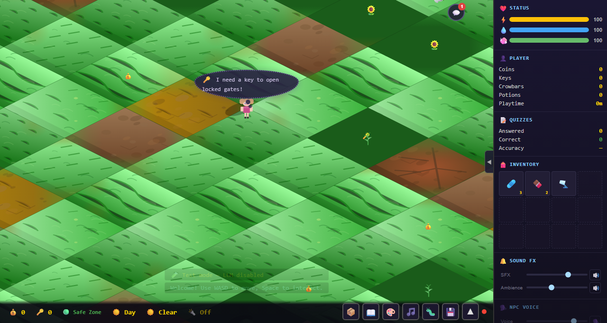

# Emily's Game

A lightweight, browser-based procedural adventure game with isometric rendering, LLM-driven entropy, educational quizzes, and biome progression.

## Current Development Status



*Screenshot automatically updated from latest main branch build*

## Vision

Emily's Game is an isometric, procedural world adventure designed for educational exploration and discovery. Players navigate a vast 1024×1024 cell world generated using novel LLM entropy mechanics, where language model outputs are mathematically processed into deterministic world seeds. The game incorporates educational elements through dynamic quizzes, a searchable in-game encyclopedia ("Book of Knowledge"), and subject-biased learning paths.

Key features include:
- **Biome Progression**: Forest → Cave → Castle with increasing difficulty
- **LLM Entropy**: SHA-256 hashed verb/noun pairs generate reproducible worlds
- **Educational Content**: 100-500 Q&A pairs per subject, rewritten for 12-year-olds
- **Isometric Rendering**: Canvas 2D with occlusion and depth sorting
- **Procedural Generation**: Hierarchical tile system with edge-matching and connectivity checks

## Core Systems

### Rendering & Engine
- Isometric rendering engine with occlusion via height-based sorting
- Canvas 2D pipeline supporting emoji/SVG sprites
- Ego character with directional animations and collision detection

### World Generation
- Tile hierarchy: Micro (1×1), World Unit (5×5), Macro (5×5 chunks)
- Procedural solver with theme bias, rotation, placement, and BFS traversability
- Auto-tiling with bitmask neighbors for visual coherence

### LLM Entropy System
- Wordlist initialization with 50 verb/noun pairs (>10 letters each)
- Movement maps to pairs, hashed via SHA-256 for seeds
- Biome selection, cell flags, and growing entropy pool
- Fallback to RNG if LLM inference >1-2s

### Character & Sprites
- Programmatic SVG character system with 3+ built-in variations
- 6-frame walking animations with caching
- Planned: Accessories, expressions, pixel art import

### Educational Mechanics
- Subject selection at game start (Math, Language, History, Science, Technology)
- Book of Knowledge: 50-100 articles per subject, searchable
- Word Bag for unfamiliar terms; "I don't know" quiz options
- Knowledge capture pipeline for content generation

### UI & Infrastructure
- Sidebar UI for inventory, stats, interaction panel
- Save/load with 3-5 slots; fog-of-war; mini-map
- Performance optimizations: Throttled animations, GC reduction, DOM sync
- Sound via Web Audio API oscillators

## Tech Stack

- **Language**: TypeScript (v5.0+)
- **Build**: Vite
- **Runtime**: Browser (Canvas 2D)
- **Assets**: Emoji/SVG-based sprites
- **LLM**: BitNet 2B4T (local via subprocess/WASM)
- **Content**: JSON assets for quizzes and encyclopedia

## Quick Start

### Prerequisites

- Node.js 16+
- npm 8+
- Local LLM server (BitNet) running on `http://127.0.0.1:8002` (optional for development)

### Installation

```bash
# Install dependencies
npm install

# Start dev server (hot reload)
npm run dev

# Build for production
npm run build
```

The dev server will typically open at `http://localhost:5173`.

### Playing

- **Move**: Arrow keys or WASD
- **Interact**: Space (when implemented)
- **Quizzes**: Answer educational questions to progress
- **Explore**: Navigate biomes, collect items, pet cats 🐈

### Scripts

- `npm run dev` - Start development server (localhost:5173)
- `npm run build` - Build for production
- `npm run typecheck` - Run TypeScript type checking
- `npm test` - Run Playwright E2E tests
- `npm run screenshot` - Capture game screenshot for README

## Project Structure

```
src/
  main.ts         - Game loop, state management
  render.ts       - Isometric rendering pipeline
  input.ts        - Keyboard input handling
  config/         - Game configuration files
  ui.ts           - DOM-based UI synchronization
  gen.ts          - Procedural world generation
  llm.ts          - LLM entropy system integration
  index.html      - Page template
Docs/             - Design documents (migrated to issues)
content/          - Educational JSON assets
tests/            - Playwright E2E tests
scripts/          - Automation scripts
.github/workflows/ - GitHub Actions CI/CD
```

## CI/CD

See `.github/workflows/ci-cd.yml` for the automated build and test pipeline.

**Note**: GitHub Pages deployment is disabled as the game requires a local LLM server connection which is not available in static hosting environments.

## Development Roadmap

### Milestone 1: PoC Complete
- [x] Isometric rendering with occlusion
- [x] Basic player movement and collision
- [x] Character sprites and animations
- [x] UI sidebar and options menu

### Milestone 2: Core Gameplay
- [x] Tile & world generation system
- [x] LLM entropy integration
- [ ] Obstacle templates (doors, bridges)
- [x] Save/load functionality

### Milestone 3: Content & Polish
- [x] Book of Knowledge encyclopedia
- [ ] Knowledge capture pipeline
- [x] Subject selection and quiz biasing
- [ ] Sound effects and polish

### Milestone 4: Infrastructure & Release
- [x] Performance optimizations
- [x] CI/CD via GitHub Actions
- [ ] Accessibility features
- [ ] Multiplayer foundations

## Contributing

See the [GitHub Issues](https://github.com/putersdcat/EmilysGame/issues) for current tasks and epics. Planning documents have been migrated to issues for better project management.

## Resources

- **Issues**: [GitHub Issues](https://github.com/putersdcat/EmilysGame/issues) - Active development roadmap
- **Archived Docs**: [archived-planning/](archived-planning/) - Historical reference

## License

TBD
