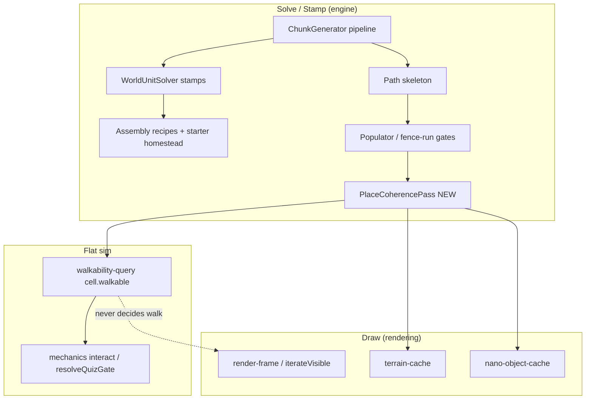
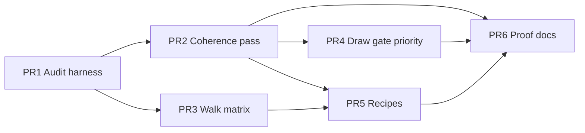

# Design: Place Coherence Epic — Gen stamp ↔ Walk SSOT ↔ Draw

| Field | Value |
|-------|--------|
| **Author** | (agent planning pass) |
| **Date** | 2026-07-19 |
| **Status** | Ready for `/execute-plan` (concurrency 1–2) |
| **Branch** | `experiment/isometric-2.0` only |
| **Epic theme** | **World solving + stamping + paint agreement** (not play-kernel / not movement) |
| **Baseline tip** | `eb9f09d` (closed homestead south fence) + play-kernel stack |
| **Supersedes for this epic** | Ad-hoc homestead/fence one-offs; expands scene-first + expandability rails |
| **Does not reopen** | Play-kernel movement thrash, FOV, new nano kinds, material factories, dual trunk |
| **Related** | `expandability-rails.md`, `design-scene-first-productization.md`, `Docs/02`, `walkability-query.ts`, `scene-invariants.ts`, `ChunkGenerator.ts`, `terrain-cache.ts` / `nano-object-cache.ts` |

---

## Overview

The product promise is **intentional places**: a child sees a farm, yard, or gatehouse that *looks* closed where it *is* closed, and only leaves through a **functional** opening. Scene-first gen and walk SSOT partially delivered that; live gaps remain where **three pipelines disagree**:

1. **Solve / stamp** (`ChunkGenerator` → WU templates → modular assemblies → path skeleton → populator / fence-run gates)  
2. **Walk** (`walkability-query` ← stamped `cell.walkable` / `ASSET_DEFS`)  
3. **Draw** (terrain cache + nano object cache + emoji/asset fallbacks)

This epic **picks place coherence** as the next huge campaign: make those three layers **one contract**, prove it with tests + screenshots, and make adding a new scene recipe the *only* cheap expansion path for places.

**Done means:**

- No walk-around a “closed” fence ring without a declared opening.  
- No paint that looks solid while the cell is walkable (or looks open while blocked), for barrier / gate / water / bridge families.  
- Homestead + 3+ modular recipes + fixed-seed chunk samples all pass a **place coherence matrix**.  
- New place = new recipe + weight; **no** `WorldUnitSolver` thrash.

---

## Why this epic (choice rationale)

| Candidate | Verdict |
|-----------|---------|
| More play-kernel / movement | **Reject for this epic** — user explicitly stepping away; RDP/control noise |
| Pure render rewrite / new nano | **Reject** — AGENTS iso2 freeze |
| Content packs only | Good later; does not fix “world looks wrong / softlocks gen” |
| **Place coherence (gen + walk + draw)** | **Pick** — highest child-visible ROI; finishes scene-first promise; pairs solving with drawing without FOV thrash |

---

## Background & evidence (tip)

### Pipeline reality (`ChunkGenerator.ts`)

Rough order today:

1. Perlin base terrain  
2. World-unit solve + stamp  
3. Passability  
4. Path skeleton (early chunks)  
5. Populate / assemblies / fence-run gates / quiz gates / entropy flags  
6. Balance / re-passability / validation  

**Risk:** late phases can re-open barriers, drop dirt flanks, or stamp paint that no longer matches `openings[]`. Homestead recently closed dirt flanks (good); modular recipes and free fence-run promotion can still disagree.

### Walk SSOT (landed)

- Runtime: `src/engine/walkability-query.ts` — **cell.walkable only**  
- Policy for tests/stamps: `walkability-policy.ts`  
- Gen must stamp truth; paint must not invent walk

### Draw path

- Terrain: `terrain-cache.ts` WU bake + blit  
- Objects: `nano-object-cache` / `drawTile` / emoji fallbacks  
- Risk: nano “closed look” vs walkable gap; incomplete bake thrash; maxDrawCmds drop objects so a gate disappears while sim still has it

### Scene law (landed, incomplete enforcement)

- `scene-invariants.ts` validate/repair after modular stamp  
- Catalog recipes declare `openings[]`  
- Free structure atoms banned early meadow (campaign done)  
- **Still weak:** chunk-level audit after *all* phases; draw↔sim visual audits; recipe expansion kit

---

## Goals & Non-Goals

### Goals

1. **Single place contract:** recipe placements + openings + `ASSET_DEFS.walkable` + repair = what the child walks and sees.  
2. **Post-pipeline coherence pass** after full chunk gen (not only after modular stamp).  
3. **Draw/sim agreement tests** for barrier/gate/water/bridge families (fixed seeds + homestead).  
4. **Render integrity:** functional gates always in draw budget when on-screen; terrain bake complete flags.  
5. **Recipe kit:** 2–4 new intentional places via catalog only (expandability rails).  
6. **Proof bar:** screenshots + Playwright matrix + gen-determinism still green.

### Non-Goals

- Play-kernel / WASD / RDP control debugging  
- New nano primitives, FOV change, material factory campaigns  
- Full EDGE_COMPAT rewrite  
- LLM entropy redesign  
- Content pack authorship (except incidental test fixtures)

---

## Proposed Design

### Layer model



**Law:** Paint never sets walkability. Coherence pass only **repairs stamps** to match openings / policy, or **fails tests** when gen invents illegal patterns.

### Place coherence invariants

| ID | Invariant |
|----|-----------|
| **P1** | Every fenced/walled enclosure on early chunks has ≥1 functional opening (`quiz_gate` \| `door_locked` family) or is not an enclosure |
| **P2** | Declared recipe `openings[]` match stamped cells after **full** chunk gen |
| **P3** | `cell.walkable === expectedWalkableDefault(assetKey)` for barrier/gate/water/bridge families (except documented overlays e.g. bridge over water) |
| **P4** | No walkable “hole” in a continuous fence/wall run unless that cell is a declared opening |
| **P5** | On-screen functional gates: at least one draw command / nano blit when within viewport (not silently dropped by budget) |
| **P6** | Homestead south perimeter: fence except sole `quiz_gate` (already stamped; regression-locked) |
| **P7** | Fixed seed: gen determinism + coherence matrix stable |

### PlaceCoherencePass (new, thin)

**File:** `src/engine/world/PlaceCoherence.ts` (or under `iso2-assemblies/`)

Runs at end of `generateChunkSync` / grid pipeline **after** population and final passability:

1. Collect modular stamps + known origin homestead footprint.  
2. `validateSceneOpenings` for each registered recipe footprint if present.  
3. Fence-run scan: seal trivial dirt gaps that are not openings (reuse/adapt `sealTrivialQuizGateBypasses` / scene repair — **do not** invent new gate kinds).  
4. Policy audit sample: fail-fast in tests; optional soft repair only for known safe cases (path → gate already in repairSceneOpenings).  
5. Emit debug counters: `coherenceRepairs`, `coherenceViolations` for F3 / tests.

**Forbidden:** changing nano geometry to fake walk; writing walkability from render.

### Draw integrity (tight, not architecture thrash)

1. **Gate priority in object draw:** when `maxDrawCmds` truncates, prefer `quiz_gate` / `door_*` / `toll_gate` over decor.  
2. **Terrain bake:** incomplete WU entries already drop/re-bake; add test that barrier cells don’t stay “empty diamond” for N frames after stamp.  
3. **No FOV change.** Optional: assert nano stack exists for barrier assetKeys used in recipes (paint completeness, not new kinds).

### Recipe expansion (content, in-epic)

Add **2–4** catalog recipes with openings + biome weights, e.g.:

- `fenced-garden-quiz` (small)  
- `meadow-shrine-gate`  
- `market-stall-row` (path openings explicit)  

Prove expandability rails: **zero** edits to `WorldUnitSolver.ts`.

---

## API / Interface Changes

```ts
// NEW
export function runPlaceCoherencePass(
  cells: CellData[][],
  meta: { chunkX: number; chunkY: number; recipes?: StampedRecipeRef[] },
): { repairs: number; violations: SceneOpeningViolation[] };

// Tests
export function assertPlaceCoherenceMatrix(chunk, cases: CoherenceCase[]): void;
```

Wire: `ChunkGenerator.generateGridChunk` final phase → `runPlaceCoherencePass`.

Debug (optional): `__gameDebug.getPlaceCoherenceStats()`.

---

## Alternatives Considered

| Alternative | Why not |
|-------------|---------|
| A. Only more content recipes | Leaves gen/draw disagreement |
| B. Rewrite WorldUnitSolver | Out of scope; slow; reopens ontology |
| C. Paint-only “looks closed” | Violates Docs/02 flat sim |
| D. **Place coherence pass + tests + recipes** | **Chosen** — measurable, legal, expandable |

---

## Risks

| Risk | Severity | Mitigation |
|------|----------|------------|
| Coherence pass fights path skeleton / passability | Med | Run **last**; only seal illegal bare gaps; tests on fixed seeds |
| Over-sealing fun shortcuts | Med | Only barrier-run holes; path openings still legal when declared |
| Draw priority changes visual density | Low | Prefer gates only under budget pressure |
| Scope creep into nano systems | High | Kill list in every PR; reviewer grep |

---

## Observability

- Coherence repair/violation counters in tests + optional F3  
- Gen-determinism suite must stay green  
- Screenshot proofs: homestead closed south; one new recipe; one fixed-seed chunk

---

## Rollout

- Branch: `experiment/isometric-2.0`  
- Concurrency: **1** preferred (shared gen files); **2** only for recipe-only PR parallel to test infra  
- No feature flags; each PR independently revertible  
- Acceptance: human glance at proofs + Playwright matrix

---

## Key Decisions

1. **Epic = place coherence (gen + walk + draw agreement), not movement.**  
2. **Post-pipeline PlaceCoherencePass** is the single enforcement point after all stamps.  
3. **Walk remains cell SSOT**; pass only repairs stamps / fails tests.  
4. **Draw integrity = gate priority + bake completeness**, not FOV/nano redesign.  
5. **Recipe expansion proves rails** without touching WorldUnitSolver.  
6. **Homestead closed south fence is regression-locked.**  
7. **PR order: audit → pass → walk matrix → draw integrity → recipes → proof.**

---

## PR Plan

### PR1 — Place coherence audit harness

| Field | Value |
|-------|--------|
| **Title** | `place-coherence: audit harness + homestead regression + fixed-seed matrix scaffold` |
| **Depends on** | — |
| **Files** | `tests/world-gen/place-coherence-*.spec.ts`; maybe `src/engine/world/PlaceCoherence.ts` **read-only audit** (no repairs yet); debug hooks optional |
| **Description** | Codify P1–P7 as tests. Lock homestead south: only `quiz_gate` opening, flanks are fence. Sample fixed seeds for enclosure holes. Report violations without changing gen yet (or soft-log). |
| **Acceptance** | Homestead regression green. Audit documents current violation count (may be >0). `tsc` clean. No WorldUnitSolver edits. |

### PR2 — PlaceCoherencePass (repair + wire into ChunkGenerator)

| Field | Value |
|-------|--------|
| **Title** | `place-coherence: post-pipeline pass seals illegal fence/wall gaps` |
| **Depends on** | PR1 |
| **Files** | `PlaceCoherence.ts`; `ChunkGenerator.ts`; reuse `scene-invariants` repair helpers; tests from PR1 expect fewer/zero illegal gaps |
| **Description** | Run pass after final population/passability. Repair: bare dirt holes in barrier runs → functional gate per existing seal helpers **or** fence if no opening declared (prefer existing `sealTrivialQuizGateBypasses` / `repairSceneOpenings` patterns). Do not invent nano. |
| **Acceptance** | Fixed-seed illegal gap rate drops to 0 on early meadow samples. Gen-determinism green. Scene-invariants green. |

### PR3 — Walk policy matrix for place families

| Field | Value |
|-------|--------|
| **Title** | `place-coherence: walk SSOT matrix for barriers gates water bridge` |
| **Depends on** | PR1 (can parallel PR2 if careful; prefer after PR2) |
| **Files** | `walkability-policy.ts` extensions; `tests/core` or `tests/world-gen` matrix; gen-collision-agreement expansion |
| **Description** | Every recipe assetKey family used in places must match policy. Bridge/water neighborhood locked. Gate locked/unlocked cell rewrite still SSOT. |
| **Acceptance** | Matrix green. No render imports in walk path. |

### PR4 — Draw integrity for functional gates

| Field | Value |
|-------|--------|
| **Title** | `place-coherence: prioritize functional gates in object draw budget` |
| **Depends on** | PR2 |
| **Files** | `render.ts` iterateObjectCells / sort or budget; tests or debug counter; optional terrain bake completeness assert |
| **Description** | When `maxDrawCmds` truncates, decor yields to quiz_gate/door_*. No FOV change. Optional: regression that on-screen homestead gate produces a tile/nano draw. |
| **Acceptance** | Synthetic overcrowded viewport still draws gate. Rendering tests green. FOV still 128×64. |

### PR5 — Recipe expansion kit (2–4 places)

| Field | Value |
|-------|--------|
| **Title** | `place-coherence: catalog recipes + biome weights (expandability rails)` |
| **Depends on** | PR2, PR3 |
| **Files** | `catalog.ts`; `iso2-assemblies.ts` weights; scene-invariants tests for new recipes |
| **Description** | Add 2–4 intentional places with openings. Zero WorldUnitSolver edits. |
| **Acceptance** | Each recipe validates openings after stamp + after full chunk gen sample. |

### PR6 — Proof bar + docs lock

| Field | Value |
|-------|--------|
| **Title** | `place-coherence: proof screenshots + AGENTS/expandability note` |
| **Depends on** | PR2–PR5 |
| **Files** | `tests/screenshots/proof-place-coherence-*.png` (or capture script); short note in `expandability-rails.md` / `AGENTS.md` campaign status |
| **Description** | Capture homestead closed south, one new recipe, one explore chunk. Document “place coherence pass is law.” |
| **Acceptance** | Screenshots checked in. Campaign status updated. Full place-coherence suite green. |



---

## Human acceptance (after stack)

1. Spawn: yard fence looks **closed**; only glowing/center gate is the exit.  
2. Walk inside yard: no dirt hole through south fence beside the gate.  
3. Open a new recipe place (if PR5): barrier has a real gate, not a random gap.  
4. Explore 2–3 chunks: no obvious “fence ring with free dirt door.”  
5. Visual: gates still appear when near (not missing sprites).

---

## Open Questions

1. When sealing a bare gap, prefer **always quiz_gate** vs **fence-close** if no recipe opening?  
   - **Default for execute-plan:** early meadow → seal with **quiz_gate** via existing fence-run helpers when gap is in a fence run; otherwise fence-close only when safe. Implementer must document choice in PR2 summary.  
2. Should coherence pass run on **all** chunks or only `|cx|+|cy| <= N`?  
   - **Default:** all chunks, but expensive scans budgeted; tests focus early meadow.

---

## References

- `Docs/02-Architecture-Core-Principle.md`  
- `memories/repo/expandability-rails.md`  
- `memories/repo/design-scene-first-productization.md`  
- `src/engine/world/ChunkGenerator.ts`  
- `src/engine/iso2-assemblies/scene-invariants.ts`  
- `src/engine/walkability-query.ts`  
- `src/rendering/render.ts`, `terrain-cache.ts`, `nano-object-cache.ts`  

---

## Execute-plan invocation (copy-paste)

```text
/execute-plan memories/repo/design-place-coherence-epic-2026-07-19.md --concurrency 1 --no-graphite --instructions "Place coherence only: gen stamp + walk SSOT + draw gate priority + recipes. No play-kernel/movement thrash. No FOV/nano kinds. No WorldUnitSolver redesign. Stay experiment/isometric-2.0. Prefer scene-invariants reuse. After each PR: scene-invariants + gen-determinism + place-coherence tests. Homestead closed south fence is regression-locked."
```
