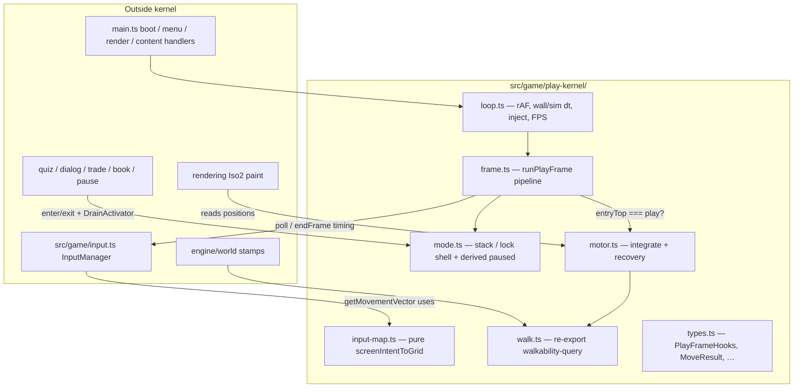
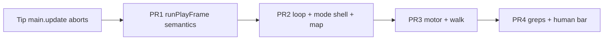

# Design: Play Kernel Only (Option 2)

| Field | Value |
|-------|--------|
| **Author** | (agent design pass) |
| **Date** | 2026-07-19 |
| **Status** | Draft rev 2 — review issues addressed; implementable by `/execute-plan` (concurrency 1) |
| **Branch** | `experiment/isometric-2.0` only (binding) |
| **Audience** | Senior engineers + `/execute-plan` operators |
| **Supersedes (play scope)** | `memories/repo/design-play-stack-first-principles-2026-07-19.md` for **time/loop, input, PlayMode, motor, walk query ownership** |
| **Does not reopen** | Nano kinds, FOV, materials, world-gen rewrite, dual-trunk, content-pack campaigns |
| **Related evidence** | `memories/repo/play-input-softlock-ownership-2026-07-19.md`, tip files under `src/game/*`, `src/main.ts`, `src/engine/walkability-query.ts` |
| **Review** | `grok-design-review-65d04352.md` (rev 2 addresses all open issues) |

---

## Overview

Replace **play-stack ownership** — time base / rAF loop, input frame lifecycle, PlayMode stack, locomotion motor, and player walk query surface — with a single minimal **play kernel**. Content systems (quiz, Book, packs, world gen, save, audio, Iso2 paint, NPCs) **stay**; they **call into** the kernel and never own freeze bits, rAF, or position integrate.

This is **not** another round of symptom patches. Tip already contains local SSOT pieces (`play-mode.ts`, `player-motor.ts`, `walkability-query.ts`, `screenIntentToGrid`, `injectDtMs`) that still **do not form one owner**. Human reports remain intermittent:

| Class | Symptom | Structural cause / campaign response |
|-------|---------|--------------------------------------|
| **A** | Dead keys after modal / embed / pause | Early-return `update()` aborts pipeline; content flags vs stack drift; **scattered `endFrame` ownership** (multiple sites may end the frame). Kernel: non-aborting frame + stack SSOT + single finally `endFrame` + same-frame interact policy (preserves tip `wasActive` law). |
| **B** | Sticky / wall-glue that feels like controls died | Tip **already** has axis slide, half-step, stuck nudges (`STUCK_MS=180`), embed ladder, wall_bump cooldown. Extraction alone is **not** a glue cure — kernel **owns orchestration** so presentation + motor cannot diverge; PR4 may tune rates if human bar fails. |
| **C** | WASD ≠ screen arrows (intermittent / merge thrash) | Map law exists; kernel owns **one** pure map + grep gate so thrash cannot reintroduce a second transform. |

**Done means:** a child can spawn → walk 1–2 minutes → real quiz gate fail/retry/open → leave, with screen-true WASD, no permanent dead keys, slide-or-clear-stop on walls, no river/solid walk-through — proven by human checklist **and** Playwright golden. When feel and green tests conflict, **feel wins**.

**Execute-plan note:** Ignore PR numbers printed inside older test file banners (e.g. “PR5/PR7” from the superseded play-stack design). Retarget imports only; do **not** implement those old PR numbers.

---

## Background & Motivation

### Product constraints (binding)

From `AGENTS.md` / `Docs/02`:

1. Stay on `experiment/isometric-2.0` — no greenfield whole game, no silent trunk switch.
2. Flat sim owns walkability; Iso2 is **paint only**.
3. FOV locked: diamonds **128×64**, `entityDisplayScale` ~1.0.
4. No new nano kinds; no barrier without function.
5. Expand via content/recipes after play is trustworthy — not via new ontology.

### Human acceptance bar (non-negotiable)

1. **W** = screen up, **A** = left, **S** = down, **D** = right (same as arrows).
2. Keys never permanently dead (no embed softlock, no orphan pause).
3. No wall-glue that feels like controls died; **slide or clear stop**.
4. No river / solid walk-through.
5. Child can: **spawn → walk 1–2 min → real quiz gate fail/retry/open → leave**.

Proof: human play checklist (final PR) + Playwright golden. Prefer feel over green tests when they conflict.

### Debt evidence (re-evaluate; do not extend patches)

| Artifact | Location | Useful signal | Why it is not the end-state |
|----------|----------|---------------|-----------------------------|
| `injectDtMs` / clamp counters | `player-motor.ts` | Hitch dash was real | Time contract belongs in **loop**, not motor |
| `screenIntentToGrid` | `input.ts` | Correct projection inverse | Must be kernel public API + sole transform |
| `play-mode.ts` stack + `recoverOrphanPause` | `src/game/play-mode.ts` | Boolean `paused` was multi-writer | Orphan recovery is a **belt**; demote after stack-slave flags |
| Constrained embed ladder | `player-motor.ts` | Noclip burst was river-slash root | Keep algorithm; separate from L0 inject |
| `walkability-query.ts` cell SSOT | `src/engine/` | Nano was Docs/02 violation | Only player walk path for motor |
| `update()` modal early-outs | `src/main.ts` | **Also** prevented same-frame Space re-fire (`wasActive`) | Must keep re-fire protection when removing abort |
| Trade `endFrame` inside handler | `handleTradeInput` | Frame end owned by handler | Not double-call; **scatter of who ends the frame** |
| Comment “tickSubsystems every frame” | `update` header | Lies vs early returns | Tip freezes world sim during modal — preserve product intent |

### What tip code actually does (cited)

**Loop** — `src/main.ts` `gameLoop` (~1226–1272) / `update` / `handleMovement`:

- Single rAF guard `_gameLoopRaf` cancel-before-start (HMR).
- Wall `dtMs` for FPS (unclamped accumulate) + sim dt via `takeInjectedDtMs()` then `update(..., simDtMs)`.
- Presentation clocks on **wall** dt: `tickWaterAnimation(wallDtMs)`, `setRenderFrameDelta(wallDtMs)`.
- After update: `finalizeInjectFrameIfActive()` (idle/modal inject latch).
- `update()` order: poll gamepad → frameCount++ → justPressed → diarrhea lock → **book early return** → quiz early return → dialog early return → trade early return → `recoverOrphanPause` → locomotion → Space → `tickSubsystems` → `endFrame`.
- Modal early-return **preserves** tip softlock fix: when quiz/dialog closes on `justKeys.interact`, Space handler does **not** run same frame (`handleQuizInput` / `handleDialogInput` capture `wasActive` before body; return true → abort). Protected by `tests/gameplay/quiz-gate-retry-loop.spec.ts`.
- `handleMovement` recomputes `Math.min(dtMs, MOVE_MAX_CATCHUP_MS)` **again**, then `integrateMovementFrame` + footsteps / sink / wall_bump / camera / chunks / autoCollect.

**Input** — `src/game/input.ts`:

- WASD ≡ arrows into `keyState.up/down/left/right` (capture phase).
- `screenIntentToGrid(sdx, sdy) → { dx: sdx+sdy, dy: -sdx+sdy }` matching `projection.ts`.
- `getMovementVector()` builds screen intent, maps, normalizes; movement is **held**, not pressQueue.
- `InputManager` stays in this file for the campaign (listeners, touch, gamepad).

**PlayMode** — `src/game/play-mode.ts`:

- Stack + `pendingNext` + `controlLock`; `locomotionAllowed` / `worldInteractAllowed`.
- `syncDerivedPaused`; only tip site that writes `state.paused =`.
- `drainPending` **imports content** (`startQuiz`, `openTrade`, …) — coupling to address (see mode boundary).
- `recoverOrphanPause` re-hydrates stack from content flags or clears orphan pause.

**Motor / Walk** — as before: constrained recovery, cell four-corner SSOT, no multi-frame noclip.

### Why "spot fix thrash" failed as strategy

1. Orchestration still lives in `main.ts`.
2. Ownership is file-local, not package-local.
3. Safety nets became product (`recoverOrphanPause`, dual clamp, inject-in-motor).
4. Merge thrash drops APIs without a single barrel contract.
5. Removing early-return without a **same-frame interact rule** re-opens a known softlock (class A “fix” that regresses gate retry).

---

## Goals & Non-Goals

### Goals

1. **Play kernel** owning: rAF loop (by end of PR2), sim dt contract, input **frame lifecycle** (poll / endFrame timing), pure screen→grid map, PlayMode **stack shell**, locomotion motor, player walk re-export.
2. Explicit **DELETE vs KEEP** kill list.
3. Module layout `src/game/play-kernel/` with fully specified hooks/types (implementers invent nothing).
4. Screen-true WASD normative matrix.
5. Content wiring without content owning `paused`.
6. Migration with **documented** product behavior for modal-time world ticks.
7. PR plan (4 PRs, PR1 slim) for `/execute-plan` concurrency 1.
8. Human play checklist as final acceptance.

### Non-Goals

- Whole-app greenfield or new engine.
- New content, FOV, materials, gen rewrite, nano kinds.
- Perfect purity beyond the playability bar.
- Migrating every `frameCount % N` polish throttle to ms.
- Replacing quiz / Book / NPC / save / audio / paint implementations.
- Moving `InputManager` class into the kernel package.

---

## Proposed Design

### 1. Play kernel architecture



**Hard ownership rules:**

| Concern | Single owner | Forbidden elsewhere |
|---------|--------------|---------------------|
| `requestAnimationFrame` game chain | `loop.ts` (after PR2) | Second integrator without cancel-before-start |
| Sim `dtMs` clamp + inject + inject latch | `loop.ts` only | Motor re-clamp; inject symbols in motor long-term |
| `input.endFrame()` | Exactly once in `runPlayFrame` **finally** | Any modal/content handler calling `endFrame` |
| Modal stack / controlLock / derived `paused` | `mode.ts` shell | `state.paused =` outside mode |
| Drain content activation (`startQuiz` / `openTrade`) | **Injected** `DrainActivator` (content-owned) | Hard-coding quiz/trade imports inside pure stack module long-term |
| `player.x/y` integrate | `motor.ts` | Content except load/reset/debug |
| Player walk query | `walk.ts` → `walkability-query.ts` | Nano / render walk in motor |
| Screen→grid transform | `input-map.ts` only (+ re-export shim) | Second map in motor/camera |
| Input device listeners | `src/game/input.ts` `InputManager` | Kernel does not own DOM key handlers |

---

### Frame pipeline (normative)

Today `update()` early-returns on book/quiz/dialog/trade. That both (a) skips tail work and (b) **prevents same-frame Space re-fire** after modal close. Kernel **never aborts the pipeline**, and **must preserve re-fire protection** via an explicit rule.

#### Same-frame interact / locomotion rule (binding — preserves tip fix)

**Normative policy: snapshot entry mode (option 1).**

```
entryTop = topMode(state)   // BEFORE any modal input phase mutates the stack
// … modal input may exitModal / drain / enter next modal …
// Phases 8–9 (locomotion + world Space) run ONLY if entryTop === 'play'
//   AND the corresponding allow predicates hold at phase time.
```

Consequences:

| Frame start | Modal closes on Space this frame | Locomotion phase | World interact phase |
|-------------|----------------------------------|------------------|----------------------|
| `entryTop === 'play'` | n/a | if `locomotionAllowed` | if `worldInteractAllowed` |
| `entryTop === quiz` (or dialog/trade/book/pause) | may pop to empty stack | **skipped this frame** | **skipped this frame** |
| `entryTop === quiz` | drain pushes trade | skipped (still non-play entry) | skipped |

This is equivalent in product effect to tip’s `wasActive` + early-return for interact, without aborting the rest of the frame.

**Forbidden:** re-evaluating `worldInteractAllowed` alone after `exitModal` with the **same** `justKeys.interact` edge and running `onWorldInteract`. That re-opens `quiz-gate-retry-loop` softlock.

**Also forbidden:** relying only on “clear justKeys.interact in handler” without snapshot — easy to miss trade/book paths. Snapshot is mandatory; clearing justKeys is optional belt.

**Hard PR1 acceptance:** `tests/gameplay/quiz-gate-retry-loop.spec.ts` stays green (not deferred to PR4).

#### Ordered phases

```
runPlayFrame(state, input, simDtMs, hooks, extras?):
  try {
    1. input.pollGamepad()
    2. state.frameCount++
    3. justKeys = input.justPressed()
    4. mode.tickControlLocks(now)           // diarrhea expiry, etc.
    5. mode.reconcileIfNeeded(state)        // see algorithm below
    6. entryTop = mode.topMode(state)       // SNAPSHOT — freeze for phases 8–9
    7. switch entryTop:
         'play'       → // no modal handler
         quiz         → hooks.onQuizInput(state, justKeys)
         dialog       → hooks.onDialogInput(state, justKeys)
         trade        → hooks.onTradeInput(state, justKeys)
         book         → hooks.onBookInput?.(state, justKeys)
         pause_menu   → hooks.onPauseInput?.(state, justKeys)
       // Book routing: prefer stack topMode; knowledge.bookOpen is slave (see reconcile)
    8. if entryTop === 'play' && mode.locomotionAllowed(state):
         mv = input.getMovementVector()
         if wantsMove:
           result = motor.integrateMovementFrame(state, mv, simDtMs, speedMult)
           hooks.onMovementPresentation(state, result, simDtMs, mv)
         else:
           motor.resolveEmbedIfNeeded(state)   // idle embed heal
           hooks.onIdlePresentation?.(state, simDtMs)
    9. if entryTop === 'play' && mode.worldInteractAllowed(state):
         hooks.onWorldInteract(state, justKeys)
   10. // Subsystem ticks — product policy (see below), NOT "always all"
       if mode.topMode(state) === 'play'   // current top after modal phase
          || only controlLock (stack empty):
         hooks.tickPlayWorld(state, justKeys, simDtMs)
       hooks.tickAlways?.(state, justKeys, simDtMs)  // optional; default no-op
  } finally {
   11. input.endFrame()
       extras?.clearExtraKeys?.()
  }
```

**`simDtMs` is already capped by the loop** (`<= MOVE_MAX_CATCHUP_MS`). Motor must **not** re-clamp; DEV may `assert(simDtMs <= MOVE_MAX_CATCHUP_MS)`.

#### Modal-time world ticks (product decision — binding)

**Preserve tip product behavior:** while a **modal stack frame** is present (quiz / dialog / trade / book / pause_menu), **world sim does not advance** via `tickPlayWorld`.

| Tick class | When | Contents (tip `tickSubsystems` split) |
|------------|------|----------------------------------------|
| `tickPlayWorld` | Stack empty (play), **including** under `controlLock` (diarrhea) | `tickStatus`, music biome, tutorial, wildlife, fog, auto-save, bubble triggers (bubbles already respect `paused`) |
| `tickAlways` | Every frame (optional hook) | Default empty / rare; do **not** put survival drain here |
| Presentation wall clocks | Every rAF in `loop` (not frame) | `tickWaterAnimation(wallDtMs)`, `setRenderFrameDelta(wallDtMs)`, FPS window |

**Not a silent behavior change:** kids are not punished with hunger drain mid-quiz (matches tip early-return). Pipeline still always reaches `finally endFrame` and reconcile.

#### Critical differences vs tip

| Tip | Kernel |
|-----|--------|
| Book/quiz/dialog/trade **abort** frame | Modal is a **phase**; pipeline completes |
| Abort also blocked same-frame Space | **`entryTop === 'play'`** gates move/Space |
| Trade (and only trade) may call `endFrame` inside handler | **Single finally `endFrame`**; handlers never call it |
| `recoverOrphanPause` after some modals only | `reconcileIfNeeded` every frame |
| Dual sim-dt clamp | **Loop publishes capped** sim dt only |
| Subsystems skip on modal (implicit) | `tickPlayWorld` only when stack empty (explicit) |

---

### `PlayFrameHooks` and related types (normative — invent nothing)

```ts
// src/game/play-kernel/types.ts

import type { GameState } from '../game-state';
import type { InputState } from '../input'; // or local JustKeys alias

/** Edge keys for one frame (same shape as InputManager.justPressed()). */
export type JustKeys = InputState;

export type MoveResult = {
  anyMoved: boolean;
  lastAttemptX: number;
  lastAttemptY: number;
};

export type MovementVector = {
  dx: number;
  dy: number;
  screenDx: number;
  screenDy: number;
};

/**
 * Content + presentation callbacks. Kernel calls these; it does not implement quiz/UI.
 * Required hooks must be provided at boot (main wires them).
 */
export type PlayFrameHooks = {
  /** Quiz modal input (navigate / submit / close). Must NOT call input.endFrame(). */
  onQuizInput(state: GameState, justKeys: JustKeys): void;
  /** Dialog advance / close → exitModal('dialog'). Must NOT call endFrame(). */
  onDialogInput(state: GameState, justKeys: JustKeys): void;
  /** Trade / barter UI. Must NOT call endFrame(). */
  onTradeInput(state: GameState, justKeys: JustKeys): void;
  /** Book: usually no-op (DOM owns book); optional. */
  onBookInput?(state: GameState, justKeys: JustKeys): void;
  /** Pause menu keys if not fully DOM-driven; optional. */
  onPauseInput?(state: GameState, justKeys: JustKeys): void;

  /**
   * Footsteps, sinkDepth visual, wall_bump SFX, facing sprites, camera lerp,
   * maybeLoadChunks, autoCollect — tip handleMovement side effects.
   * Not pure motor.
   */
  onMovementPresentation(
    state: GameState,
    result: MoveResult,
    simDtMs: number,
    mv: MovementVector,
  ): void;
  /** Idle frame presentation (sprites / embed visual). Optional. */
  onIdlePresentation?(state: GameState, simDtMs: number): void;

  /** Space → interact with world (gates, NPCs). Only if entryTop was play. */
  onWorldInteract(state: GameState, justKeys: JustKeys): void;

  /**
   * World sim while stack empty (status, wildlife, fog, auto-save, tutorial, …).
   * Tip tickSubsystems body minus anything moved to tickAlways.
   */
  tickPlayWorld(state: GameState, justKeys: JustKeys, simDtMs: number): void;

  /** Optional always-on (default omit). Must not include survival drain. */
  tickAlways?(state: GameState, justKeys: JustKeys, simDtMs: number): void;
};

/**
 * Content-owned drain activation — registered once at boot.
 * Kernel mode.exitModal pops stack then asks this to sync-activate pending frames.
 * Avoids mode.ts importing quiz/trading (circular dependency).
 */
export type DrainActivator = {
  /** Sync-activate quiz from pendingQuiz / insect payload; return true if quiz.active. */
  activateQuiz(state: GameState, frame: Extract<ModalFrame, { kind: 'quiz' }>): boolean;
  /** Sync-activate trade from pendingTrade; return true if trade.active. */
  activateTrade(state: GameState, frame: Extract<ModalFrame, { kind: 'trade' }>): boolean;
  /** Optional: book / rare dialog on queue. */
  activateBook?(state: GameState): void;
};

export type ModalKind = 'pause_menu' | 'dialog' | 'quiz' | 'trade' | 'book';

export type GateRef = { chunkKey: string; lx: number; ly: number };

export type ModalFrame =
  | { kind: 'pause_menu' }
  | { kind: 'dialog'; owner: string }
  | { kind: 'quiz'; owner: string; gate?: GateRef }
  | { kind: 'trade'; owner: string }
  | { kind: 'book' };

export type ControlLock =
  | { reason: 'diarrhea'; untilMs: number }
  | { reason: 'chunk_rebuild' }
  | { reason: 'overlay' }
  | null;

export type PlayModeState = {
  stack: ModalFrame[];
  pendingNext: ModalFrame[];
  controlLock: ControlLock;
};

export type PlayLoopContext = {
  state: GameState;
  input: { pollGamepad(): void; justPressed(): JustKeys; getMovementVector(): MovementVector; endFrame(): void };
  hooks: PlayFrameHooks;
  /** After runPlayFrame + finalize inject latch — typically renderFrame. */
  onAfterFrame: () => void;
};
```

**Error policy:** hooks must not throw in product paths; if a hook throws, `finally` still runs `endFrame` (pipeline try/finally). No automatic modal recovery on throw.

**Who owns `tickSubsystems` today:** body moves into `hooks.tickPlayWorld` (main or extracted module). Kernel only **schedules** the call when stack empty.

---

### `reconcileIfNeeded` (normative)

Replaces ad-hoc reliance on `recoverOrphanPause` as product strategy.

```ts
/**
 * Every frame, after control-lock tick, before entryTop snapshot.
 * Returns whether a heal ran (for observability counter).
 */
export function reconcileIfNeeded(state: GameState): boolean {
  // 1) Derived paused must match stack | lock
  syncDerivedPaused(state);

  // 2) Content slaves: flags that should mirror stack
  //    bookOpen  ↔  hasModalKind(book)
  //    Prefer stack as authority: if stack has book and !bookOpen → set bookOpen true
  //    if bookOpen && !stack book → enterModal(book)  // heal once (or DEV assert only after PR2)

  // 3) Orphan paused: paused && stack empty && lock null && no content owner
  //    → paused = false  (same as tip recoverOrphanPause clear branch)

  // 4) Content active without stack (quiz.active / dialog.active / trade.active / pause DOM)
  //    without matching frame → enterModal with owner 'orphan_recover'  (tip heal)
  //    OR in DEV: console.assert + heal

  // 5) After PR4: steps 3–4 become DEV-only assert + counter; product golden must not need heal
}
```

| Phase | Behavior |
|-------|----------|
| PR1 | Call existing `recoverOrphanPause` from `reconcileIfNeeded` wrapper (thin). Book path **must** use stack: if `bookOpen`, ensure book frame before snapshot (no early-return). |
| PR2 | DEV asserts: `bookOpen iff has book frame`; `quiz.active` implies quiz on stack (or document re-deal edge); fire counter on heal. |
| PR4 | Product heal demoted: DEV assert + counter; golden path heal count = 0. |

**Book authority:** `topMode` / stack owns freeze. `knowledge.bookOpen` is a **slave** updated by `setBookOpen` / enter/exit book. Frame phase 7 dispatches book via `entryTop === book` (or stack has book), **not** via “if bookOpen return”.

---

### Public API surface (normative)

```ts
// src/game/play-kernel/index.ts

export type {
  PlayFrameHooks, PlayLoopContext, MoveResult, MovementVector, JustKeys,
  DrainActivator, ModalFrame, ModalKind, ControlLock, PlayModeState, GateRef,
} from './types';

// Loop (PR2+)
export {
  startPlayLoop, stopPlayLoop,
  injectDtMs, takeInjectedDtMs, noteSimDtRaw, noteDtClamped,
  finalizeInjectFrameIfActive, getTimeContractSnapshot, getDtClampedCount,
} from './loop';

// Frame (PR1+)
export { runPlayFrame } from './frame';

// Mode shell (PR2+)
export {
  createEmptyPlayMode,
  enterModal, exitModal, queueAfterClose, clearPendingNext,
  setControlLock, resetPlayMode,
  locomotionAllowed, worldInteractAllowed, topMode, hasModalKind,
  enterQuizModal, enterDialogModal, setBookOpen,
  tickDiarrheaControlLock, syncDerivedPaused, reconcileIfNeeded,
  registerDrainActivator, // boot-time DrainActivator
} from './mode';

// Motor (PR3+)
export {
  integrateMovementFrame, resolveEmbedIfNeeded, resetPlayerMotor,
  MOVE_STEP_MS, MOVE_MAX_CATCHUP_MS, STUCK_MS,
} from './motor';

// Pure map (PR2+)
export { screenIntentToGrid } from './input-map';

// Walk re-export (PR3+)
export { isWalkable, isPositionWalkable, isFootprintWalkable } from './walk';
```

`main.ts` (end state): boot → register `DrainActivator` + `PlayFrameHooks` → menu → `startPlayLoop`. Content handlers **do not** own the loop or `endFrame`.

**Not exported as kernel-owned implementations:** `InputManager`, quiz/trade DOM, renderFrame.

---

### Mode / content boundary (pragmatic A)

| Layer | Lives in | Imports content? |
|-------|----------|------------------|
| Stack, pendingNext, controlLock, enter/exit shell, derived paused, queries | `play-kernel/mode.ts` | **No** |
| `DrainActivator` implementation | `main` or `interaction-handler` / small `mode-drain.ts` under `src/game/` | Yes (quiz, trade) |
| `PlayModeState` types | `play-kernel/types.ts` (or `src/types/` if game-state needs types without pulling mode impl) | No |
| Helpers `enterQuizModal` | mode shell (stack only; assumes content already activated) | No |

**`exitModal` drain algorithm:**

```
pop matching top; closeContentForKind via activator or thin callbacks
while pendingNext non-empty && stack empty:
  frame = shift pendingNext
  if quiz: ok = activator.activateQuiz(...); if ok enterModal(frame)
  if trade: ok = activator.activateTrade(...); if ok enterModal(frame)
  if book: activator.activateBook?.(); enterModal(frame)
  …
```

During PR1, tip `play-mode.ts` body may remain as-is (still imports content). PR2 extracts pure shell + injects activator — **do not** relocate content imports into “kernel purity” without activator.

---

### 2. What to DELETE vs KEEP

#### Kill list

| Item | Action |
|------|--------|
| Early-return **abort** of frame for book/quiz/dialog/trade | **DELETE**; phased pipeline |
| Same-frame world Space after modal close without entry snapshot | **DELETE** / never reintro; PR1 hard gate |
| Handler-owned `endFrame` (trade internal, modal early-return sites) | **DELETE**; single finally only |
| `recoverOrphanPause` as **product** strategy | **DEMOTE** after PR2 asserts; PR4 DEV-only |
| Direct `state.paused =` outside mode | **DELETE**; grep gate |
| Multi-frame noclip / escape burst / forceEscape | **DELETE forever** |
| `spawnEscape` as collision bypass | **DELETE** (visual only remains) |
| Dual sim-dt clamp | **DELETE** motor re-clamp; loop only |
| Inject/clamp counters in motor | **MOVE** to `loop.ts` |
| Content flags as freeze **authority** | **DELETE** authority; slaves only |
| Nano / activeConditions as player walk | **DELETE** any re-wire into motor |

#### Keep list (wire, do not rewrite)

Quiz, dialog, trade, book, pause, gen stamps, save/load, audio, Iso2 paint, NPCs, projection, constrained motor algorithm, cell walk query, Playwright golden (retarget imports). Tip **same-frame Space protection** (semantics) — keep via `entryTop` snapshot.

---

### 3. Module layout

```
src/game/play-kernel/
  index.ts
  types.ts          # PlayFrameHooks, DrainActivator, Modal*, MoveResult, …
  frame.ts          # runPlayFrame
  loop.ts           # rAF, inject, FPS, wall presentation clocks, finalizeInject
  mode.ts           # stack shell + reconcile + registerDrainActivator
  motor.ts          # locomotion only (no inject)
  input-map.ts      # screenIntentToGrid pure
  walk.ts           # re-export engine walkability-query
```

`src/game/input.ts` — **stays** `InputManager`; imports `screenIntentToGrid` from `input-map` (or re-exports for one PR).

**Migration dual path:**

| PR | Ownership |
|----|-----------|
| PR1 | `frame.ts` + types; mode/motor/input still tip paths; rAF still `main` |
| PR2 | `loop.ts` + mode shell + input-map; rAF moves; inject moves |
| PR3 | motor + walk |
| PR4 | greps clean, orphan demote, human checklist |

---

### 4. Screen-true WASD (normative)

**Law:** WASD ≡ arrows → same four bits = **screen intent**.

Projection: `screenX ∝ (x − y)`, `screenY ∝ (x + y)`.

Map: `dx = sdx + sdy`, `dy = −sdx + sdy`, then normalize.

#### Normative test matrix

| Key(s) | Screen intent `(sdx,sdy)` | Grid pre-norm `(dx,dy)` | After norm | On-screen |
|--------|---------------------------|-------------------------|------------|-----------|
| W / ↑ | `(0, −1)` | `(−1, −1)` | `(−√½, −√½)` | Up |
| S / ↓ | `(0, +1)` | `(+1, +1)` | `(+√½, +√½)` | Down |
| A / ← | `(−1, 0)` | `(−1, +1)` | `(−√½, +√½)` | Left |
| D / → | `(+1, 0)` | `(+1, −1)` | `(+√½, −√½)` | Right |
| W+D | `(+1, −1)` | `(0, −2)` | `(0, −1)` | Up-right |
| W+A | `(−1, −1)` | `(−2, 0)` | `(−1, 0)` | Up-left |
| S+D | `(+1, +1)` | `(+2, 0)` | `(+1, 0)` | Down-right |
| S+A | `(−1, +1)` | `(0, +2)` | `(0, +1)` | Down-left |

**Ownership:** only `input-map.ts` implements the transform; `InputManager.getMovementVector` is the sole runtime caller; re-export shim in `input.ts` allowed. **PR2 grep gate:** no second `function screenIntentToGrid` / duplicate formula under `src/` outside `input-map` + shim.

**PR2 agent acceptance (not eyeball):** `tests/core/play-stack-input-matrix.spec.ts` green + `tests/gameplay/play-stack-golden.spec.ts` WASD / live key section green (or equivalent evaluate projecting player before/after synthetic W). Human eyes = PR4 checklist 1–3.

---

### 5. Wiring: content → kernel

Handshake unchanged in product:

| Content action | Same sync turn |
|----------------|----------------|
| Open dialog | `showDialog` then `enterDialogModal` |
| Close dialog | `exitModal('dialog')` → drain via `DrainActivator` |
| Start quiz | `startQuiz` sync active then `enterQuizModal` |
| Close quiz | `exitModal('quiz')` |
| Gate correct | `resolveQuizGate` then exit quiz |
| Trade / book / pause | enter/exit mode APIs only |
| Diarrhea / chunk rebuild | `setControlLock` / clear in `finally` |

**Forbidden:**

- Freeze without stack frame or controlLock in the same turn.
- `enterModal(quiz)` without `quiz.active`.
- `void startQuiz().then` as sole activation.
- Handler-owned `endFrame`.
- World interact same frame as modal `entryTop !== 'play'`.

---

### 6. Migration plan



#### Tip → target map (expanded)

| Today | Target |
|-------|--------|
| `main.gameLoop` body | `loop.ts` (PR2): rAF, wall dt, FPS window, inject take/note/clamp, `tickWaterAnimation`, `setRenderFrameDelta`, `runPlayFrame`, `finalizeInjectFrameIfActive`, `onAfterFrame` render, cancel-before-start |
| `main.update` | `frame.ts` `runPlayFrame` (PR1) |
| `handleMovement` | motor (PR3) + `onMovementPresentation` hook |
| `play-mode.ts` | pure shell `mode.ts` + external `DrainActivator` (PR2) |
| `player-motor` locomotion | `motor.ts` (PR3) |
| `player-motor` inject* / `finalizeInjectFrameIfActive` / `noteSimDtRaw` / `getTimeContractSnapshot` / `getDtClampedCount` | `loop.ts` (PR2) |
| `input.screenIntentToGrid` | `input-map.ts` + re-export (PR2) |
| `walkability-query` | engine + `walk.ts` re-export (PR3) |
| Quiz/dialog/trade handlers | stay in main (or extract later); become hooks; **strip endFrame** |
| `recoverOrphanPause` | wrapped by `reconcileIfNeeded`; demote PR4 |

#### `loop.ts` inventory (must not drop — copy from tip `gameLoop` ~1226–1272)

1. Cancel-before-start / single `_gameLoopRaf` id  
2. Wall `dtMs` finite/negative guard → `MOVE_STEP_MS`  
3. FPS window: unclamped `_fpsWindowFrames` / `_fpsWindowMs` → `state.fps`  
4. `takeInjectedDtMs()`; else wall; finite guard  
5. `noteSimDtRaw(simRaw)`; if raw > `MOVE_MAX_CATCHUP_MS` then `noteDtClamped()`  
6. **Publish** `simDtMs = min(max(raw,0), MOVE_MAX_CATCHUP_MS)` to frame  
7. Wall presentation: `tickWaterAnimation(wallDtMs)`, `setRenderFrameDelta(wallDtMs)`  
8. `runPlayFrame(state, input, simDtMs, hooks)`  
9. `finalizeInjectFrameIfActive()`  
10. `onAfterFrame()` → render; perf marks; schedule next rAF  

#### Class B note

PR3 acceptance = mechanical (no water, no pop-through, hitch clamp). Class B human item 5 + optional automated: hold into wall N frames → `anyMoved === false` for blocked frames **and** `locomotionAllowed === true` **and** frame completed (endFrame ran). If human still reports glue, PR4 may retune `WALL_BUMP_COOLDOWN_MS` / `STUCK_MS` / nudge budget — **no new systems**.

---

## Data model

| Field | Rule |
|-------|------|
| `playMode` | SSOT freeze |
| `paused` | Derived only |
| `player.x/y` | Motor + load/reset/debug |
| `spawnEscape` | Visual only |
| `bookOpen` / `quiz.active` / … | Content UI slaves, not freeze authority |
| Saves | Load → `resetPlayMode` + `resetPlayerMotor` |

---

## Alternatives Considered

| ID | Choice | Verdict |
|----|--------|---------|
| A1 | Spot-fix thrash | Reject |
| A2 | Full first-principles L5–L7 campaign | Reject for this campaign |
| A3 | Play kernel (this) | Accept |
| A4 | Greenfield outside `src/game` | Reject |
| A5 | Always tick all subsystems during modal | Reject — changes product (hunger mid-quiz); tip freezes world sim |
| A6 | Consume justKeys only (no entry snapshot) | Reject as sole rule — easy to miss paths; snapshot mandatory |
| A7 | Keep content imports inside mode.ts forever | Accept only as PR1 interim; PR2 activator |

---

## Observability

| Signal | Owner |
|--------|-------|
| FPS unclamped wall | `loop.ts` |
| dtClampedCount / inject latch | `loop.ts` |
| Mode top + pending + lock | `__gameDebug` |
| Embed recovery / step-4 | motor |
| `reconcileIfNeeded` heal count | mode — trend to 0 |
| Illegal footprint | DEV assert motor |

---

## Verification

### Automated

| Spec | Role |
|------|------|
| `quiz-gate-retry-loop.spec.ts` | **PR1 hard** — no same-frame re-fire |
| `play-stack-input-matrix.spec.ts` | PR2 map |
| `play-stack-time-clamp.spec.ts` | inject 500ms |
| `play-stack-motor-recovery.spec.ts` | embed legal |
| `play-stack-mode-ownership.spec.ts` | modal gates |
| `play-stack-golden.spec.ts` | hitch + WASD + resume |
| `walkability-ssot.spec.ts` | cell SSOT |

### Human play checklist (PR4 binding)

| # | Action | Pass |
|---|--------|------|
| 1 | W and ↑ | Screen up both |
| 2 | A/S/D and arrows | Match; screen axes |
| 3 | W+D | Up-right diagonal |
| 4 | River 8-way | Clear stop; never on water |
| 5 | Hold wall 3s | Slide or clear stop; keys feel alive |
| 6 | Quiz gate fail/retry/open/walk | Soft fail; open; pass |
| 7 | NPC dialog → quiz/trade → close | Move within one frame |
| 8 | Book open/close; pause resume | Move immediately |
| 8b | Quiz **I don't know** → Book opens → close Book | WASD within one frame (setBookOpen/drain edge) |
| 9 | Tab unfocus 5s holding D | No map dash |
| 10 | Dense embed / reload | Legal recover; no river slash |
| 11 | Free walk 1–2 min + leave via opened gate | No intermittent dead keys |
| 12 | 5–15 min session (aspirational) | Product goal |

---

## Key Decisions

1. **Play kernel owns rAF (by PR2), sim-dt contract, input frame lifecycle, pure screen map, mode stack shell, motor, walk re-export.** Content implements hooks + `DrainActivator`; never writes `paused` or second-integrates position. `InputManager` stays in `src/game/input.ts`.

2. **Frame pipeline never aborts; locomotion + world interact run only if `entryTop === 'play'`** (snapshot before modal phase). Preserves tip same-frame Space re-fire fix (`quiz-gate-retry-loop`). Single `endFrame` in `finally` only.

3. **`PlayFrameHooks` + `DrainActivator` + `reconcileIfNeeded` are fully specified in `types.ts` / mode** — implementers do not invent APIs. Modal-time **world sim frozen** (`tickPlayWorld` only when stack empty); wall presentation clocks stay on rAF wall dt.

4. **Screen-true WASD** = pure `input-map` inverse of projection; WASD ≡ arrows; pre-norm diagonals use integer sums (e.g. W+D → `(0,-2)`); grep forbids second transform.

5. **Motor keeps constrained recovery + cell four-corner SSOT; noclip forever forbidden.** Class B = own orchestration + verify feel; package move is not by itself a glue cure.

6. **Loop publishes capped `simDtMs` only; motor does not re-clamp.** All inject/finalize/FPS/wall clocks listed in loop inventory move with `loop.ts`.

7. **Mode pure shell + injected drain (boundary A).** PR2 removes long-term content imports from kernel mode. `reconcileIfNeeded` wraps heal; PR4 demotes product heal after stack-slave asserts.

8. **PR1 is pipeline-only** (no mandatory rAF move) so concurrency-1 is not blocked by dual mechanical+semantic risk.

---

## PR Plan

Ordered, concurrency **1**. Ignore superseded design’s PR1–PR7 numbers in old test banners.

### PR1 — Non-aborting `runPlayFrame` (pipeline only)

| Field | Value |
|-------|--------|
| **Title** | `play-kernel: runPlayFrame — no abort, entryTop Space guard, single endFrame` |
| **Depends on** | — |
| **Files** | **Add** `src/game/play-kernel/types.ts`, `frame.ts`, `index.ts` (frame exports only). **Edit** `src/main.ts`: replace `update()` body with `runPlayFrame`; strip `endFrame` from `handleTradeInput` / modal early-return sites; wire hooks to existing handlers; book uses stack/topMode not abort. **Do not** move rAF or inject in this PR. Mode/motor remain tip modules. |
| **Description** | Implement normative pipeline + **entryTop snapshot** for phases 8–9. `reconcileIfNeeded` thin-wraps `recoverOrphanPause`. `tickPlayWorld` = existing `tickSubsystems` when stack empty. try/finally `endFrame`. |
| **Acceptance** | `tsc --noEmit`. **`quiz-gate-retry-loop` green (hard).** Mode ownership + golden still pass. Manual: close quiz/dialog with Space — no immediate re-open; after next frame, move works. Grep: no `endFrame` inside quiz/dialog/trade handlers. Subsystems do **not** drain hunger during open quiz (stack non-empty). |

### PR2 — Loop + mode shell + input-map

| Field | Value |
|-------|--------|
| **Title** | `play-kernel: loop inventory, pure mode shell + DrainActivator, screenIntentToGrid` |
| **Depends on** | PR1 |
| **Files** | **Add** `loop.ts`, `mode.ts`, `input-map.ts`. **Edit** `main` gameLoop → `startPlayLoop`. **Move** inject* / finalize / time snapshot from motor → loop (re-export shims one PR). **Edit** `play-mode.ts` → re-export shell; content drain → `registerDrainActivator`. **Edit** `input.ts` → import map from kernel. **Edit** input-matrix + golden WASD tests (import paths). |
| **Acceptance** | Loop inventory complete (no dropped finalize/FPS/wall clocks). Time-clamp green. Input matrix + golden WASD green. Grep: single `screenIntentToGrid` definition path. DEV reconcile asserts for book/stack. `state.paused =` only in mode. |

### PR3 — Motor + walk surface

| Field | Value |
|-------|--------|
| **Title** | `play-kernel: motor + walk re-export; no motor re-clamp; no noclip` |
| **Depends on** | PR2 |
| **Files** | **Add** `motor.ts`, `walk.ts`. **Edit** `player-motor.ts` → re-export. Presentation stays in hooks. Motor tests / embed / walkability-ssot. |
| **Acceptance** | Inject 500ms no multi-cell teleport. Embed → legal. River hold: four corners never water. Wall hold: no pop-through; optional “blocked but locomotionAllowed” regression. DEV assert `simDtMs <= MOVE_MAX_CATCHUP_MS` if desired. |

### PR4 — Grep-driven wire + orphan demote + human bar

| Field | Value |
|-------|--------|
| **Title** | `play-kernel: finish greps, demote orphan heal, human play checklist` |
| **Depends on** | PR3 |
| **Files (grep-driven only)** | See audit table below — **not** open-ended “touch all content.” |
| **Description** | Clean remaining handshake drift; demote `recoverOrphanPause` product path; human checklist. Feel knobs only if class B fails. |
| **Acceptance** | Grep audit clean. Heal count 0 on golden paths. **Human checklist 1–11 (+8b) pass.** Playwright play-stack suite green. |

#### PR4 grep-driven work items (pre-enumerated)

| Grep / check | Action if hit outside allowed owner |
|--------------|-------------------------------------|
| `state\.paused\s*=` | Only `play-kernel/mode.ts` (or thin re-export) |
| `\.endFrame\(` | Only `runPlayFrame` finally (+ tests) |
| `recoverOrphanPause` | Only inside `reconcileIfNeeded` / DEV |
| `bookOpen\s*=\s*true` without `enterModal`/`setBookOpen` | Fix handshake |
| `quiz\.active\s*=\s*true` without enter quiz modal same turn | Fix handshake |
| Noclip / `escapeBurst` / forceEscape symbols | Must be absent |
| Second `screenIntentToGrid` body | Forbidden |
| `integrateMovementFrame` callers | Kernel frame + debug only |

Do **not** edit `quiz*.ts` / packs unless a grep hit requires a handshake one-liner.

---

## Security & Privacy

Local single-player. Debug inject remains test/dev. No save schema expansion.

---

## Appendix A — Tip call graph (evidence)

```
main.gameLoop
  → wall dt, FPS, inject, wall presentation clocks
  → update  // today may abort
       → modal handlers (wasActive) / early return + endFrame
       → recoverOrphanPause
       → handleMovement / Space
       → tickSubsystems
       → endFrame
  → finalizeInjectFrameIfActive
  → renderFrame
```

Kernel: `loop` always completes wall clocks + `runPlayFrame` (try/finally endFrame) + finalize + render. Modal cannot abort frame; `entryTop` blocks same-frame Space.

## Appendix B — Supersession

| Superseded topic | This design |
|------------------|-------------|
| L0–L4 ownership | Absorbed into kernel |
| L5 gen expansion | Out of scope |
| Old PR1–PR7 numbers | **Ignore** in test banners; this doc’s PR1–PR4 only |

---

## Document control

| Version | Note |
|---------|------|
| 2026-07-19 | Initial play-kernel-only (option 2) |
| 2026-07-19 rev 2 | Address design review: entryTop re-fire rule, PlayFrameHooks/reconcile/DrainActivator, PR1 slim, modal tick policy, mode boundary A, clamp bind, endFrame wording, matrix pre-norm, input ownership, loop inventory, PR4 greps, checklist 8b |
