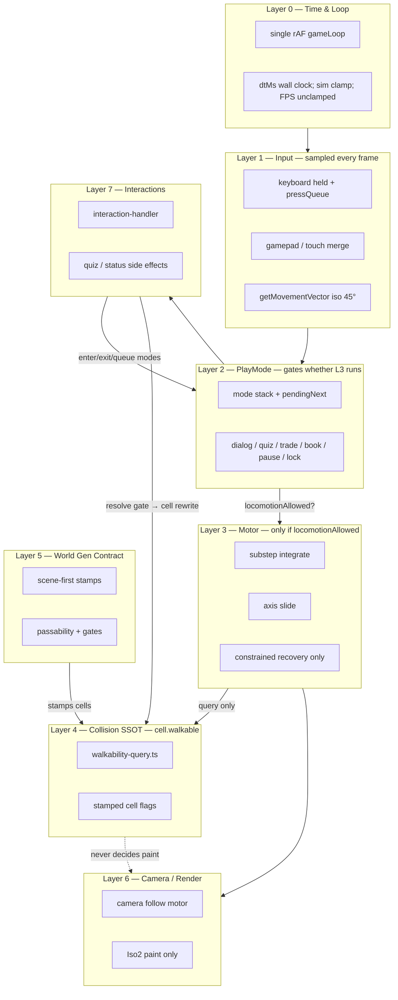
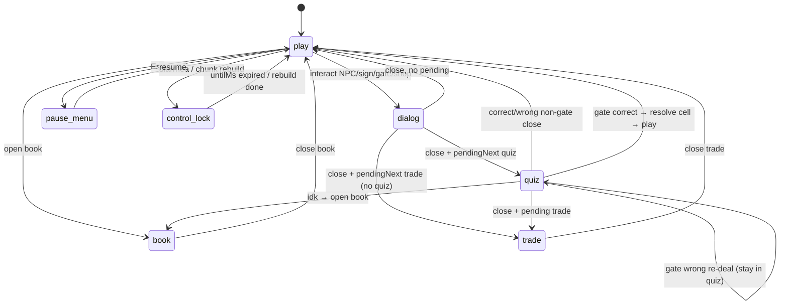
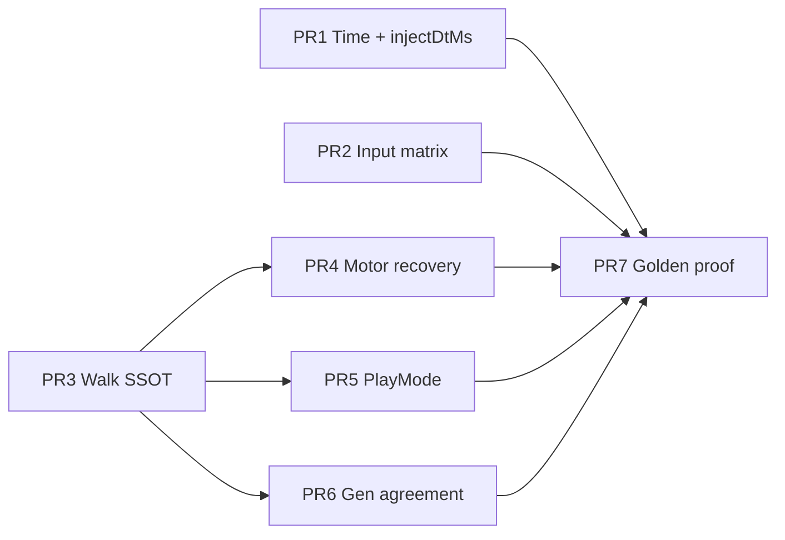
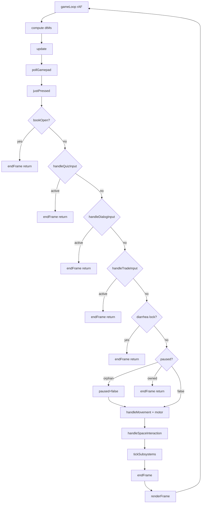

> **HISTORICAL as of 2026-08-13.** Memory of work past. Not living law.
> Current law: root `AGENTS.md`. Living design: `docs/intent/`.
> Scavenge ideas. Do not obey paint-only / no-greenfield / stay-on-branch /
> closed-campaign / FOV-lock / one-scoped-goal framing in this file.
# Design: Play Stack Foundation — First Principles QC & Re-architecture

| Field | Value |
|-------|--------|
| **Author** | (agent design pass) |
| **Date** | 2026-07-19 |
| **Status** | Draft (revision 3 — PR4/PR5 implementability) |
| **Branch** | `experiment/isometric-2.0` only (binding) |
| **Audience** | Senior engineers + `/execute-plan` operators |
| **Related** | `Docs/02-Architecture-Core-Principle.md`, `Docs/03-Core-Simulation-Model.md`, `memories/repo/play-input-softlock-ownership-2026-07-19.md`, `memories/repo/design-playable-session-recovery.md`, `AGENTS.md` |
| **Supersedes as scope** | Symptom-only movement patches; treats recent motor/softlock work as **debt evidence**, not the product design |

---

## Overview

The play stack — time base, input, play-mode ownership, locomotion, walkability, world-gen contract, camera/render feedback, and interaction side effects — has been repaired by **local patches** (dt substeps, stuck-escape bursts, orphan-pause recovery, sync quiz activate, real-time illness timers). Playtest still shows **systemic** failures: hitch → dash, river tunneling, keyboard freeze after interactions, FPS that lies relative to feel. Those are not independent bugs; they are symptoms of **scattered ownership**, **dual walkability authorities**, and **escape policies that violate flat-sim laws**.

This design rebuilds a **layered correctness model** of the entire play stack from first principles. It defines invariants per layer, a golden session contract (menu → spawn → move → gate → fail → open → leave), a verification matrix that assumes axes may be inverted, and a dependency-ordered PR plan. Prefer **one source of truth** and deep rewrites inside `src/game` + collision authority over more patches. Stay on `experiment/isometric-2.0`; do **not** greenfield the app or thrash FOV/nano/material factories.

**Done means:** a child can complete a 5–15 minute session with reliable movement, real quiz gates, no river slash, no input softlock, and no post-hitch dash — proven by deterministic tests **and** manual play matrix.

**Architecture alignment:** `Docs/02` already requires flat-sim ownership of walkability/progression. Live code does **not** fully obey that law today (`mechanics.ts` imports `getNanoStack` from rendering). This campaign restores the written law; it does not invent a new one.

---

## Background & Motivation

### Product bar (binding)

From `AGENTS.md` / docs:

1. Flat sim owns walkability and progression; Iso2 is paint only (`Docs/02`).
2. FOV locked: on-screen diamonds **128×64**, `entityDisplayScale` ~1.0.
3. No barrier without function (`quiz_gate` | `door_locked` | explicit open path).
4. Proof = playtest of a satisfying short session; expand via content/recipes after foundation is trustworthy.
5. Stay on `experiment/isometric-2.0` — no trunk switch, no greenfield rewrite of the whole app.

### Why symptom patches failed as strategy

Recent agent work correctly identified *some* failure modes and left useful debris:

| Patch | File(s) | What it fixed | What it revealed |
|-------|---------|---------------|------------------|
| dt substeps + catch-up cap | `player-motor.ts`, `main.ts` | Hitch teleports of multi-tile leaps in one integrate | Speed units were "per frame" folklore; time base was half-migrated |
| Stuck escape burst (noclip 200ms) | `player-motor.ts` | Fence-post glue softlock | **Noclip crosses rivers and solids** — primary "slash over water" path |
| `ensureNotEmbedded` → `spawnEscape` | `player-motor.ts` | Embed after load | Auto multi-frame noclip on fractional clip (hitch×dash co-cause) |
| Orphan `paused` recovery | `main.ts` `update()` | Forever keyboard freeze after hung quiz | `paused` is a shared bit with no typed owner or stack |
| Sync `startQuiz` activate | `quiz.ts` | `paused=true` with `quiz.active=false` | Async activation is illegal for modal ownership |
| Illness real-time ms | `illness.ts` | Frame-count lock at 2 FPS → 12 min freeze | **Player-affecting** frame locks are landmines; remaining `frameCount % N` uses are mostly polish throttles (not equivalent debt) |

Treating these as the *design* would polish inverted foundations. This document instead asks: **what must each layer guarantee so the layer above cannot lie?**

### Observed symptoms (symptoms only)

1. Stall / hitch → keyboard feels "queued" → sudden uncontrolled dash across the map.
2. Player tunnels over rivers and other non-walkable solids.
3. Freeze / no keyboard response after interactions (quiz, dialog, trade).
4. FPS/display lying vs feel (smooth number, sluggish or bursty motion).
5. After successive "fixes," mess continues — classic multi-ownership debt.

---

## Goals & Non-Goals

### Goals

1. Document a **bottom-up architecture** of the play stack with explicit communication rules between layers.
2. Publish an **invariant table** per layer (must always be true in live play and tests).
3. Define the **golden play-loop contract** for a child session.
4. Provide a **verification plan**: deterministic unit/integration tests + manual play matrix (WASD/arrows, iso directions, solid blocks, no backlog dash).
5. Give an **honest keep/replace assessment** of player-motor, dt scaling, escape burst, nano full-tile collision, `paused` bit, etc.
6. Produce a **dependency-aware PR plan** for `/execute-plan` (foundational layers first).
7. Prefer **one source of truth** — re-architect when ownership is scattered.
8. Specs must be **implementable**: PlayMode stack transitions, recovery constants, walk query API, and PR acceptance checklists are normative (not conceptual sketches only).

### Non-Goals

- New nano kinds, material factories, FOV changes, or EDGE_COMPAT rewrites.
- Greenfield rewrite of the entire app, switching to `main`, or dual-trunk work.
- Expanding scene recipes / content packs (comes *after* foundation is trustworthy).
- Solving every education/NPC/trading UX polish issue (only where it owns play-mode or softlocks).
- Replacing the isometric presentation layer or projection math unless verification proves axes wrong.
- Converting every `frameCount % N` polish throttle to ms (documented debt; not player softlock).

---

## Proposed Design

### Layered architecture (authoritative mental model)



**Note:** This is an ownership diagram, not a separate pipeline. Real control flow is Appendix A: every frame L0 samples input (L1), L2 modal gates decide whether L3 runs, then L6 paints. L2 does **not** sit as a pre-filter that skips input sampling.

**Communication rules (hard):**

| From → To | May | Must not |
|-----------|-----|----------|
| L0 → all | Publish `dtMs`, frame index for polish only | Advance player-affecting locks by bare `frameCount` deadlines |
| L1 → L2/L3 | Held move vector; edge `justPressed` | Integrate position; set walkability |
| L2 → L3 | Boolean "locomotion permitted" + optional speed mult from modes | Mutate `player.x/y` |
| L3 → L4 | Query `isFootprintWalkable` only | Bypass collision; multi-frame noclip |
| L4 | Answer walkability from **stamped cell flags** | Import render families / SVG / nano draw stacks |
| L5 → L4 | Write `assetKey` + `walkable` (+ `resolved`) consistent with stamp rules | Leave barrier without function; leave water walkable |
| L6 | Read positions / cell kinds for paint | Decide gate open, walkability, or progression |
| L7 → L2 | Enter/exit/queue modes via `play-mode.ts` only | Set `paused=true` outside play-mode |
| L7 → L4 | Cell rewrite on correct quiz (`resolveQuizGate`) | Global condition unlock that opens every gate |

---

### Layer 0 — Time & loop

**Current code (evidence):**

- `src/main.ts` `gameLoop(time, ctx)` — single rAF via `_gameLoopRaf` cancel-before-start (HMR double-loop guard exists).
- `dtMs = time - _lastFrameTime`, non-finite/negative → `MOVE_STEP_MS` (16.67).
- Movement clamps to `MOVE_MAX_CATCHUP_MS = 100` inside **both** motor and `handleMovement` (redundant but consistent; only motor integrates position).
- Position writers in product path: **`player-motor.ts` only**. Other writers: `save-apply.ts`, `game-reset.ts`, `debug-api.setPlayerPosition` (load/debug — not per-frame integrate).
- FPS: rolling window of rAF ticks; **distortion:** `_fpsWindowMs += Math.min(dtMs, MOVE_MAX_CATCHUP_MS)` so severe hitches are **under-counted** in displayed FPS (contributes to "FPS lies vs feel").
- `tickWaterAnimation(dtMs)`, `setRenderFrameDelta(dtMs)` use real delta.
- **Polish debt (non-blocking):** `tickSubsystems` throttles wildlife/fog/bubbles/auto-save on `state.frameCount % N`. These are **not** player-affecting locks (illness already uses `LOCK_DURATION_MS`). Do not expand PR1 into a full throttle migration.

**Speed unit debt:** `PLAYER_CONFIG.speed = 0.08` comment says "Grid units per frame"; motor treats it as **grid units per `MOVE_STEP_MS` (1/60 s)**. Fix comment in PR1.

**Invariants (L0):**

| ID | Invariant |
|----|-----------|
| T0 | Exactly one rAF owner at a time (`_gameLoopRaf`). |
| T1 | Player-affecting durations use real ms (`performance.now()` or accumulated `dtMs`), never bare `frameCount` **deadlines**. |
| T2 | Per-frame simulation integration uses `dtMs` clamped to `[0, MOVE_MAX_CATCHUP_MS]`. Excess hitch time is **dropped**, not queued into a backlog. |
| T3 | Display FPS is derived from **unclamped** wall rAF intervals (fix clamp-on-accumulate distortion in PR1). |
| T4 | `player.speed` is documented and enforced as **grid units per `MOVE_STEP_MS`**, not "per display frame." |
| T5 | Only one sim path integrates player position per frame (`integrateMovementFrame`); no second integrator. |

**"Done" for L0:** Under artificial hitch injection (500ms via test-only `injectDtMs` / debug hook):

1. Player displacement that frame ≤ displacement of `MOVE_MAX_CATCHUP_MS` at current speed.
2. No multi-second catch-up dash over subsequent frames.
3. **No** `spawnEscape` and no stuck-recovery grant solely because the player was wall-blocked during the hitch frame (after PR4).
4. Displayed FPS for that second reflects the hitch (unclamped sample).

---

### Layer 1 — Input

**Current code (evidence):**

- `src/game/input.ts` `InputManager`:
  - **Held:** `keyState` / touch / gamepad OR-merged in `getState()`.
  - **Edge:** `pressQueue` latched on keydown, cleared in `endFrame()`; `justPressed()` uses queue OR held against `prevState`.
  - **Movement:** `getMovementVector()` uses **held/analog**, not pressQueue — so "queued dash" is **not** primarily pressQueue backlog for WASD.
- Iso 45° transform (screen intent → grid):

```ts
// getMovementVector — intentional isometric alignment
dx = sdx + sdy;
dy = -sdx + sdy;
// then normalize
```

**Verification vs projection** (`src/rendering/projection.ts`):

```
screenX ∝ (rx − ry),  screenY ∝ (rx + ry)
```

| Physical key | Screen intent (sdx,sdy) | Grid (dx,dy) after 45° | Expected screen motion |
|--------------|-------------------------|------------------------|------------------------|
| W / ArrowUp | (0, −1) | (−1, −1) after norm | Up (sy decreases) |
| S / ArrowDown | (0, +1) | (+1, +1) | Down |
| A / ArrowLeft | (−1, 0) | (−1, +1) | Left |
| D / ArrowRight | (+1, 0) | (+1, −1) | Right |
| W+D | (+1, −1) | (0, −√2) → (0,−1) | Up-right diagonal |
| W+A | (−1, −1) | (−√2, 0) → (−1,0) | Up-left diagonal |

**Assume axes may be inverted until proven:** ship a pure `screenIntentToGrid(sdx, sdy)` + unit table; if product wants different feel, change **one** map function.

**Invariants (L1):**

| ID | Invariant |
|----|-----------|
| I0 | Movement reads **held** state only; interact/menu reads **edge** (`justPressed` + pressQueue). |
| I1 | Every update path that early-returns must call `input.endFrame()`. |
| I2 | Iso map is a pure function of screen intent; no second rotation in motor or camera. |
| I3 | When PlayMode denies locomotion, held keys must **not** accumulate motion credit (no backlog). They may remain held for *after* unpause — intentional "resume walking," not a dash. |
| I4 | Device merge is OR of digital + preferred analog; magnitude normalized once. |

#### Hitch → dash diagnosis (L0 × L1 × L3) — complete

Not pressQueue. Ranked mechanisms:

| Rank | Mechanism | Confidence |
|------|-----------|------------|
| 1 | **Escape burst noclip** after freeze against wall while keys held (450ms blocked → 200ms free write) | **Primary** for river slash + dash |
| 2 | **`ensureNotEmbedded` → `spawnEscape` multi-frame noclip** when hitch substeps leave fractional footprint illegal | **High co-cause** (no 450ms wait) |
| 3 | **`forceEscape` one-shot + sets `spawnEscape=true`** after burst grant (`integrateMovementFrame` ~174–183) | Same family as #1–2 |
| 4 | Uncapped dt / double rAF | Partially mitigated (cap + single-rAF guard); still assert |
| 5 | Camera/render lag (feel only; position may be correct) | Presentation |

PR4 must eliminate 1–3. PR1 instruments 4 and fixes FPS sample for 5's diagnostic clarity.

---

### Layer 2 — Play mode / modal ownership

**Current code (evidence):**

- `state.paused: boolean` written from many sites (see **PR5 writer checklist** below).
- Live **stacking** is implicit via `pendingQuiz`, `pendingTrade`, `pendingGateQuiz`, book-open flags, and dialog-close chains in `main.ts` / `interaction-handler.ts` — not via typed mode nesting.
- `update()` gate order: book → quiz → dialog → trade → diarrhea lock → orphan-pause recovery → movement.
- Orphan recovery: if `paused` but no owner among `{quiz.active, dialog.active, trade.active, bookOpen, pauseMenu DOM}`, clear pause.
- `startQuiz` sets `quiz.active = true` **before** any `await`.

**Problem:** A boolean cannot express owner, stack, or pending queue. Recovery is a safety net for a broken model.

#### Normative model: base `play` + modal stack + pending queue

```ts
// src/game/play-mode.ts — normative shapes

export type ModalKind = 'pause_menu' | 'dialog' | 'quiz' | 'trade' | 'book';

export type ModalFrame =
  | { kind: 'pause_menu' }
  | { kind: 'dialog'; owner: string }           // 'npc:id' | 'sign' | 'quiz_gate' | 'shop' | ...
  | { kind: 'quiz'; owner: string; gate?: GateRef }
  | { kind: 'trade'; owner: string }
  | { kind: 'book' };

export type ControlLock =
  | { reason: 'diarrhea'; untilMs: number }
  | { reason: 'chunk_rebuild' }                // slot-actions temporary
  | null;

export interface PlayModeState {
  /** Modal stack; top = active UI. Empty ⇒ free play (unless controlLock). */
  stack: ModalFrame[];
  /**
   * Queued modes to push when the current top exits.
   * Owned ONLY by play-mode.ts; interaction-handler calls queueAfterClose().
   * Replaces ad-hoc pendingQuiz/pendingTrade *ownership* (fields may remain
   * as payload carriers for question data / persona id).
   */
  pendingNext: ModalFrame[];
  controlLock: ControlLock;
}

// Derived paused for one release (compat / greps):
//   paused === stack.length > 0 || controlLock != null
// (includes diarrhea + chunk_rebuild — both freeze play input)

/** Motor may run only when true. */
export function locomotionAllowed(state: GameState): boolean {
  if (state.playMode.controlLock) return false;
  if (state.playMode.stack.length > 0) return false;
  return true;
}

/**
 * World interact (Space → handleSpaceInteraction / open dialog from world)
 * is blocked whenever locomotion is blocked. Modal input (quiz keys, dialog
 * advance, trade nav) still runs via topMode handlers before this gate.
 */
export function worldInteractAllowed(state: GameState): boolean {
  return locomotionAllowed(state);
}

export function topMode(state: GameState): ModalFrame | 'play' {
  const s = state.playMode.stack;
  return s.length ? s[s.length - 1]! : 'play';
}
```

**Stack rules:**

| Rule | Detail |
|------|--------|
| S0 | At most one **active** UI frame is top-of-stack; lower frames are suspended (not painted as active). Prefer **depth ≤ 1** in practice: push quiz **after** dialog pops, not under it. |
| S1 | `enterModal` only **registers** the frame on the stack and keeps derived `paused` true. **Content owners** (`showDialog` / `startQuiz` / `openTrade` / pause-menu DOM) are responsible for filling UI state and `*.active` — see **side-effect handshake** below. |
| S2 | `exitModal(kind)` pops only if top.kind matches; runs content close side-effects for that kind; then drains `pendingNext` FIFO by invoking content helpers (not a second raw `active=true`). |
| S3 | `queueAfterClose(frame)` appends to `pendingNext` (used when opening dialog that should lead to quiz/trade). Caller must also set payload carriers (`pendingQuiz` / `pendingTrade` / `pendingGateQuiz`) **before** or with the queue call. |
| S4 | `controlLock` is orthogonal to the modal stack. While non-null: **no locomotion** and **no world Space interact** (`worldInteractAllowed === false`). `update()` still runs status/audio/dt ticks. Modal handlers only run if a stack frame is also present (unusual during diarrhea). |
| S5 | Book: enter `book` on open; exit on close. Quiz "I don't know" that opens book: exit quiz, enter book (pending gate cleared per existing product rules). |
| S6 | Pause menu: enter only via play-mode; DOM `#pauseMenu` display is a **presentation slave** of mode, not an owner that `update()` polls forever (migrate off DOM-as-owner). |
| S7 | No direct `state.paused =` outside `play-mode.ts` after PR5 (grep gate). |
| S8 | `setControlLock(null)` must run in slot-actions `finally` (and when diarrhea expires). Restore: if stack non-empty after unlock, keep stack (e.g. pause menu was open under rebuild); mirror today's `wasPaused` restore. |

**Why depth-1 preferred:** Current product already models dialog→quiz as *sequential* (close dialog, then start quiz), not stacked UIs. Stack type still allows emergency nesting; product transitions below use queue-on-close.

#### Side-effect handshake (normative — PR5 implementability)

**Principle:** `startQuiz` / `openTrade` / `showDialog` remain **content owners**. They sync-activate their subsystem, then call `enterModal`. `exitModal` drain only **invokes those helpers** — never a parallel `quiz.active = true` path that can race `void startQuiz().then`.

| Mode action | Same sync turn must also… |
|-------------|---------------------------|
| Open dialog (NPC/sign/gate/shop/worms) | 1) Set payload carriers + `queueAfterClose` if needed. 2) `showDialog(...)` (sets lines + `ui.dialog.active`). 3) `enterModal({ kind:'dialog', owner })`. |
| `exitModal('dialog')` | 1) `closeDialog` / cancel speech as today. 2) Pop dialog frame. 3) **Drain** `pendingNext` (below). |
| Drain → `quiz` frame | 1) Read `pendingQuiz` payload. 2) Call `startQuiz(...)` (**sync** activate inside). 3) If `startQuiz` returns `false` / no question: **do not** push quiz; toast; stay `play` (or next pending). 4) If ok: `enterModal({ kind:'quiz', owner, gate? })` — stack only; quiz already active. Clear `pendingQuiz` after successful start. |
| Drain → `trade` frame | 1) `openTrade(persona)` from `pendingTrade`. 2) If fail: unfreeze (play). 3) If ok: `enterModal({ kind:'trade', owner })`. Clear `pendingTrade`. |
| Direct quiz (injury / hygiene / insect) | Content helper (`startInjuryQuiz` / `startHygieneQuiz` / `startInsectQuiz` or inlined `startQuiz`) **sync-activates quiz**, then `enterModal({ kind:'quiz', owner })`. **Single owner:** never `enterModal(quiz)` without `startQuiz` first, and never `startQuiz` without `enterModal` in the same turn. |
| Gate wrong re-deal | Stay on quiz frame; call `startQuiz` again (sync); **do not** pop/push stack. |
| Gate correct | `resolveQuizGate` cell rewrite; `exitModal('quiz')` → play (no pending trade usually). |
| `enterModal(pause_menu)` | Show `#pauseMenu` DOM (slave). |
| `exitModal(pause_menu)` | Hide `#pauseMenu`; pop. |
| `enterModal(book)` / exit | Existing book open/close; stack mirrors `knowledge.bookOpen`. |
| `setControlLock(diarrhea)` | No modal; `worldInteractAllowed` false; overlay as today. Clear lock when `untilMs` elapsed. |
| `setControlLock(chunk_rebuild)` | No world interact / move; `finally` → `setControlLock(null)` and restore stack-derived pause (not always `paused=false`). |

**Drain algorithm (`exitModal` after pop):**

```
while pendingNext non-empty && stack empty:
  frame = pendingNext.shift()
  if frame.kind === 'quiz':
    ok = startQuizFromPending(state)  // uses pendingQuiz; sync active
    if (ok) enterModal(frame) else toast + continue loop
  else if frame.kind === 'trade':
    ok = openTradeFromPending(state)
    if (ok) enterModal(frame) else continue
  else:
    enterModal(frame)  // book/dialog rare on queue
```

**Forbidden orders (softlock class):**

- `paused=true` / `enterModal` without content `*.active` in the same turn.
- `void startQuiz().then(...)` as the only activation path (activate is sync inside `startQuiz`; `.then` may only handle failure cleanup).
- Drain that sets `quiz.active=true` without going through `startQuiz`.

#### Transition graph (normative product flows)



| Flow | Sequence |
|------|----------|
| Gate | Set `pendingGateQuiz` + `pendingQuiz`; `queueAfterClose(quiz)`; `showDialog` + `enterModal(dialog)` → exit dialog → drain → `startQuiz` + `enterModal(quiz)` → wrong re-deal stay quiz; correct resolve + exit → play |
| NPC with quiz + trade | dialog; queue quiz then trade → drain startQuiz → exit quiz → openTrade |
| Shop | dialog; queue trade → drain openTrade |
| Sign | dialog only → play |
| Book | enter book → exit → play |
| Pause menu | enter pause_menu → resume exit → play |
| Diarrhea | `setControlLock({diarrhea, untilMs})`; no locomotion **and** no world interact until expired |
| Chunk rebuild | `setControlLock({chunk_rebuild})` in slot-actions; `finally` clear + restore stack pause |
| Injury / hygiene quizzes | Direct `startQuiz` (or specials helper) then `enterModal(quiz)` — no dialog |
| Worms → insect quiz | `eat_worms` dialog; set `_pendingInsectQuiz` **or** `queueAfterClose(quiz{owner:'insect'})` + payload; on dialog exit drain/start insect quiz (same handshake as NPC quiz) |
| Wildlife dialog | `showDialog` + `enterModal(dialog)`; optional `pendingQuiz` like NPC |

**Payload carriers (remain on GameState, not ownership):**

- `pendingQuiz` — question/difficulty/npcId for `startQuiz` (set when queueing quiz frame).
- `pendingGateQuiz` — cell coords for resolve on correct.
- `pendingTrade` — persona id for `openTrade`.
- `_pendingInsectQuiz` — migrate to `queueAfterClose(quiz{owner:'insect'})` + payload in PR5 (or keep flag but drain must call the same `startInsectQuiz` path).

Ownership of *when* those fire is `pendingNext` drain + handshake table above.

#### PR5 writer checklist (acceptance)

**A. Grep `state.paused =` — zero outside `play-mode.ts`:**

| File | Role today |
|------|------------|
| `src/main.ts` | quiz/dialog close chains, wildlife dialog, orphan recovery |
| `src/game/interaction-handler.ts` | NPC, sign, quiz_gate, shop, eat_worms |
| `src/game/pause-menu.ts` | open/resume/main-menu |
| `src/game/injury.ts` | injury quiz pause |
| `src/game/quiz-specials.ts` | hygiene / insect quizzes |
| `src/game/dom-wiring.ts` | book / inventory adjacent pause |
| `src/game/input-extra-keys.ts` | Esc / book / cancel paths |
| `src/game/options-overlay.ts` | unpause on close |
| `src/game/slot-actions.ts` | chunk rebuild lock |
| `src/game/startup-hud.ts` | book close callback |
| `src/game/debug-api.ts` | book-linked pause |
| `src/game/quiz.ts` | docs only (callers set paused) |

**B. Grep content-active writers — each maps to handshake:**

| Pattern | Map to |
|---------|--------|
| `quiz.active =` / `startQuiz` | content then `enterModal(quiz)` or re-deal without stack churn |
| `showDialog` / `closeDialog` / `ui.dialog.active` | with `enterModal`/`exitModal(dialog)` |
| `openTrade` / `trade.active` | with `enterModal`/`exitModal(trade)` |
| `_pendingInsectQuiz` | queueAfterClose or drain helper |
| `knowledge.bookOpen` | enter/exit book |
| `#pauseMenu` display | slave of pause_menu frame |

**Invariants (L2):**

| ID | Invariant |
|----|-----------|
| M0 | Motor uses `locomotionAllowed` only; world Space uses `worldInteractAllowed` (same predicate). |
| M1 | Content `*.active` and stack frame agree **in the same synchronous turn** (handshake table). |
| M2 | No play freeze without stack frame, controlLock, or (legacy) recoverable orphan. |
| M3 | `pendingNext` drained only by `exitModal` via content helpers; no raw `paused=true` races. |
| M4 | Transition graph + handshake are the product contract; new flows extend both. |
| M5 | `controlLock != null` blocks locomotion **and** world interact; status/audio ticks still run. |

**"Done" for L2:** Orphan pause recovers one frame; greps A+B clean; gate/NPC/shop/worms/injury flows still work; diarrhea cannot open world dialog.

---

### Layer 3 — Motor / integration

**Current code (evidence):** `src/game/player-motor.ts` + `handleMovement` in `src/main.ts`.

```
speed 0.08 gu / MOVE_STEP_MS ≈ 4.8 cells/s
substep: while remaining dt: step ≤ 16.67ms
axis slide if full step blocked
THREE noclip paths:
  (a) _escapeBurstMs > 0
  (b) state.player.spawnEscape
  (c) forceEscape one-shot after grant, which also sets spawnEscape=true
ensureNotEmbedded: if !isFootprintWalkable → spawnEscape=true
```

**Honest assessment:**

| Piece | Verdict | Rationale |
|-------|---------|-----------|
| `player-motor.ts` as ownership boundary | **KEEP** | Correct place for locomotion. |
| dt scaling + substeps | **KEEP** | Right model for variable FPS. |
| `MOVE_MAX_CATCHUP_MS = 100` | **KEEP** (tune only with playtest) | ~0.48 cells/frame max at default speed. |
| Full noclip paths (a)(b)(c) | **DELETE** | All free position writes without walk checks are illegal after PR4. |
| `spawnEscape` | **REDEFINE** | Visual/state only (`sinkDepth`); may request one embed recovery; **never** multi-frame noclip. |
| Axis slide | **KEEP** | Standard. |

#### Constrained recovery — implementable algorithm (PR4 normative)

**Constants (export from `player-motor.ts`):**

| Name | Value | Meaning |
|------|-------|---------|
| `STUCK_MS` | `450` | Hold-move with zero displacement before stuck recovery (same as today) |
| `NUDGE_EPS` | `0.08` | Grid units per nudge attempt |
| `NUDGE_MAX_ATTEMPTS` | `8` | Max legal trials per stuck grant |
| `EMBED_R_LADDER` | `[2, 4, 8]` | Chebyshev radii tried in order for one embed event |
| `MOVE_STEP_MS` | `1000/60` | Unchanged |
| `MOVE_MAX_CATCHUP_MS` | `100` | Unchanged |

**Deleted:** `STUCK_ESCAPE_BURST_MS`, `_escapeBurstMs`, `forceEscape` parameter that skips walk checks, multi-frame noclip via `spawnEscape`.

**Embed detection (normative):**

> **Embed** iff `!isFootprintWalkable(player.x, player.y, chunks)` — **full four-corner footprint**, same as collision. Not center-only.

**Failed-embed escalate ladder (normative — closes softlock; no noclip):**

One **embed event** = first frame that detects embed (or resume/load detection). Recovery runs the full ladder **once per event** until a legal destination is found (may span a single PRE call — all steps same frame preferred):

| Step | Action |
|------|--------|
| 1 | `findNearestLegalFootprintCenter` with R from `EMBED_R_LADDER` in order (`2` → `4` → `8`). First non-null wins. |
| 2 | If still null: **loaded-chunk BFS** — from `floor(player)` cells, 4-connected, accept first cell whose **center** `(cx+0.5, cy+0.5)` passes `isFootprintWalkable` (water/walls excluded via cell.walkable). Cap visits (e.g. 4096) for hitch safety. |
| 3 | If still null: **deterministic safe cell** — `PLAYER_CONFIG.startPosition` if walkable; else chunk `(0,0)` center after passability; else first walkable cell found in any loaded chunk scan. |
| 4 | If still null (should be impossible in product gen): stay put + once toast + **dev assert**. Never grant noclip. |

Module state: `_embedEventActive` — set when embed detected; clear when footprint becomes legal after teleport. Do **not** re-run full BFS every frame while stuck at step 4; re-run ladder only on new embed event (legal → illegal transition) or explicit load/resume.

**Algorithm each movement frame (`integrateMovementFrame`):**

```
1. PRE: if embed:
     dest = resolveEmbedDestination(player)  // ladder steps 1–3 above
     if dest:
       player.x, player.y = dest   // single write; dest MUST pass isFootprintWalkable
       player.spawnEscape = false
       player.sinkDepth = 0
       clear embed event
     else:
       // step 4 only: stay illegal; visual sinkDepth; toast once; no integrate
     return  // skip substeps this frame after teleport-or-fail

2. SUBSTEP integrate (existing axis-slide) with ALL steps requiring isFootprintWalkable
   — no escape flag branch that writes without check

3. POST stuck-legal recovery:
   if wantsMove && !anyMoved:
     blockedMs += frameMs
     if blockedMs >= STUCK_MS:
       blockedMs = 0
       try stuckNudges(mv):
         candidates ordered:
           a) along input: (mv.dx, mv.dy) * NUDGE_EPS
           b) along input * 2ε
           c) perpendicular ±: (-mv.dy, mv.dx)*ε and (mv.dy, -mv.dx)*ε
           d) axis unit: (±ε,0), (0,±ε) favoring input sign
         for each candidate up to NUDGE_MAX_ATTEMPTS:
           trial = (x+dx, y+dy)
           if isFootprintWalkable(trial): commit; anyMoved=true; break
       // else stay put — wall_bump SFX from handleMovement
   else if anyMoved or !wantsMove:
     blockedMs = 0

4. HARD POST-CONDITION (dev assert + test):
   isFootprintWalkable(player.x, player.y) === true
   OR (ladder exhausted AND position unchanged — step 4 only)
   // Never: mid-frame illegal commit; never: multi-frame noclip
```

**`findNearestLegalFootprintCenter(px, py, R)` — single sampling rule:**

- Integer cell offsets `(ox, oy)` with `max(|ox|,|oy|) ≤ R` (Chebyshev).
- Test footprint at **`(floor(px) + ox + 0.5, floor(py) + oy + 0.5)` only** (cell centers).
- Ring order: radius `r = 0..R`; within ring, fixed 8-connected order **N, NE, E, SE, S, SW, W, NW** (skip offsets not on that ring).
- Accept first center where `isFootprintWalkable` is true.
- Water / wall / locked gate fail via cell.walkable SSOT.
- If none: return null (caller escalates ladder).

**`spawnEscape` after PR4:**

| Was | Becomes |
|-----|---------|
| Multi-frame collision bypass + sinkDepth | Optional **visual** flag + sinkDepth during recovery / rare step-4 failure; **never** read by integrate as walk bypass |
| Cleared on first walkable step under noclip | Cleared when footprint legal after ladder teleport |

**Tests that must rewrite:** `tests/gameplay/spawn-escape-hatch.spec.ts` — obsolete "bypass until walkable / walk out through cottage." Replace with: resume inside cottage → within 1 recovery call player footprint is legal (courtyard via R=2 ladder). Optional: dense-embed fixture proves R=4/8 or BFS lands legal without noclip.

**Invariants (L3):**

| ID | Invariant |
|----|-----------|
| P0 | After every committed position write, footprint is walkable. Failed ladder (step 4) is the only legal illegal stay — must be vanishingly rare and toast+assert. |
| P1 | No motor path may ignore walkability for water / wall / locked gate. |
| P2 | Substep size ≤ one `MOVE_STEP_MS` scale; total per frame ≤ catch-up cap. |
| P3 | Motor does not open modals, resolve gates, or load chunks. |
| P4 | Speed multipliers applied once per frame. |
| P5 | Zero noclip timers; zero `if (escape) { x=newX }` branches. |
| P6 | Embed recovery is escalating and finite (ladder); product play never relies on permanent illegal stay. |

---

### Layer 4 — Collision / walkability (flat sim SSOT)

**Current code (evidence):**

- Gen writes `cell.walkable` (`Passability.ts`, `ObstacleSolver.ts`, scene stamps).
- Runtime `isPositionWalkable` may route through `getNanoStack` + `isPointWalkableInTile` (**rendering import**).
- Unresolved `quiz_gate` → `cell.walkable` only (keep).
- Full-tile structural solids in nano path (2026-07-15) — but dependency direction still wrong.
- Bridges: nano `always` overlays open tile; **cell path relies on gen stamping `bridge` walkable:true** — must stay true under cell-only SSOT.

#### Normative runtime rule (implement this)

```ts
// src/engine/walkability-query.ts  — NO imports from src/rendering/**

export function isPositionWalkable(
  px: number,
  py: number,
  chunks: Map<string, ChunkData>,
): boolean {
  // unloaded chunk → true (gen-on-entry)
  // OOB local → true
  const cell = ...;
  // Unresolved quiz gates: cell.walkable only (always false until resolve)
  if (cell.assetKey === 'quiz_gate' && !cell.resolved) return cell.walkable;
  return cell.walkable;
}

export function isFootprintWalkable(
  px: number, py: number,
  chunks: Map<string, ChunkData>,
): boolean {
  // four corners with PLAYER_CONFIG.collisionHalfW/H
  // NO activeConditions parameter on gameplay path
}
```

**Runtime authority = stamped `cell.walkable` (+ `resolved` for quiz_gate).** There is **no** second runtime recompute from asset key.

#### Policy module (tests + stamp helpers only)

```ts
// src/engine/walkability-policy.ts
/** Default expected walkable for a freshly stamped assetKey from ASSET_DEFS (+ overrides). */
export function expectedWalkableDefault(assetKey: string): boolean;

/** Overrides: water* → false; bridge* → true; quiz_gate/door_locked → false; door_open → true; ... */
```

- Used for **W4 gen agreement tests** and optional stamp helpers.
- **Not** consulted by `isPositionWalkable` at runtime (avoids dual authority).

#### Module split (PR3 deliverable)

| Module | Contents | Imports rendering? |
|--------|----------|-------------------|
| `walkability-query.ts` | `isPositionWalkable`, `isFootprintWalkable`, `isWalkable` | **No** |
| `walkability-policy.ts` | `expectedWalkableDefault`, override table | **No** (config/ASSET_DEFS only) |
| `mechanics.ts` | `interact`, `resolveQuizGate`, `autoCollect`, invalidations | May invalidate render caches **after** cell rewrite; walk queries re-export from query module |

Call-site updates: `player-motor.ts`, `state-init.ts`, `debug-api.ts` drop `activeConditions` from footprint checks.

**Deprecate gameplay use of `activeConditions` for gates.** Debug `resolveQuizGateSim` must not be called from production; PR3/PR7: grep/assert production paths never set global `'quiz-gate' → unlocked` for movement.

#### Penetration / water rule (normative)

> **W1 hard:** After every committed integrate, **all four** footprint sample points must be non-water (i.e. each sample's cell is walkable under cell SSOT). No ε that allows "standing half in river." Footprint half-extents 0.3 already limit corner touch; if a corner sample hits water, the move is illegal (same as any blocked cell).

Manual matrix and automated river tests use this rule — not "center grass, toes in water OK."

#### PR3 test inventory (migration)

| Spec | Action under cell-only SSOT |
|------|-----------------------------|
| `tests/rendering/iso2-b-asset-nano-kind-completeness.spec.ts` | Retarget: nano kind completeness is **paint** concern; walk assertions move to cell.walkable / policy tests; drop "narrow arm" walk expectations |
| `tests/rendering/iso2-b-bridge-walkability-proof.spec.ts` | **Keep product asserts** (bridge walkable, water not) via cell stamps; remove dependency on nano path |
| `tests/rendering/iso2-c-gate-connectivity-fix.spec.ts` | Assert full-tile block via cell; unlock via `resolveQuizGate` rewrite not global condition |
| `tests/world-gen/water-bridge.spec.ts` | Keep / strengthen stamp integrity |
| `tests/gameplay/playability-m1-core-loop.spec.ts` | Keep (already cell/gate oriented) |
| `tests/gameplay/spawn-escape-hatch.spec.ts` | Rewrite in PR4 (embed teleport) |

**Invariants (L4):**

| ID | Invariant |
|----|-----------|
| W0 | Walk query module has **zero** imports from `src/rendering/**`. |
| W1 | Water / river cells never pass footprint samples after commit. |
| W2 | Locked `quiz_gate` / `door_locked` never walkable until cell rewrite. |
| W3 | Unloaded chunk samples return walkable (gen-on-entry). |
| W4 | Gen stamps match `expectedWalkableDefault` for asset keys (test-only policy). |
| W5 | Bridge cells stamped walkable; adjacent water not — regression matrix required. |

---

### Layer 5 — World gen ↔ collision contract

**Contract (formal):**

| Producer | Must guarantee |
|----------|----------------|
| Terrain / water | `water*` → `walkable:false`; `bridge*` → `walkable:true` |
| Barriers | Fence/wall runs have a declared functional opening or path |
| Gates | `quiz_gate` stamped `walkable:false`, `interactable:true` until resolve |
| Spawn | Chunk (0,0) start cell + clearance walkable; resume uses embed recovery if gen drift |
| Paint (L6) | May change how water/walls look; must not change walk flags |

Scene-first laws unchanged (`scene-invariants.ts`).

---

### Layer 6 — Camera / render feedback

- Camera lerp in `handleMovement` when moving; FOV locked 128×64.
- Long render frames inflate `dtMs` → sim clamp (T2) prevents position dash; camera may still feel rubbery.
- Debug: separate "update ms vs render ms" so FPS is not confused with sim feel.

| ID | Invariant |
|----|-----------|
| R0 | Camera follows sim; never writes walkability or gate state. |
| R1 | FOV 128×64; entity scale ~1.0 unless RFC. |
| R2 | Long frames drop sim catch-up (T2). |
| R3 | Display FPS uses unclamped wall dt (T3). |

---

### Layer 7 — Content / quiz / interaction side effects

- Gate success: `resolveQuizGate` cell rewrite — **correct** SSOT.
- Gate fail: re-deal without clearing pending gate — correct.
- All mode entry via play-mode after PR5.
- Diarrhea: real-time `controlLock`.

| ID | Invariant |
|----|-----------|
| C0 | Interactions open modes via L2 API only. |
| C1 | Gate open = cell rewrite only. |
| C2 | Side effects use ms timers for player locks. |
| C3 | Space interact works while moving (keep). |

---

## Golden play-loop contract

```mermaid
sequenceDiagram
  participant Child
  participant Menu as menu-flow
  participant Loop as gameLoop L0
  participant Mode as PlayMode L2
  participant Motor as motor L3
  participant Walk as walkability L4
  participant Gate as quiz/gate L7

  Child->>Menu: Continue / New Game
  Menu->>Loop: start single rAF
  Loop->>Mode: stack empty, play
  Child->>Motor: hold W
  Note over Mode: locomotionAllowed true
  Motor->>Walk: isFootprintWalkable cell SSOT
  Walk-->>Motor: yes/no
  Child->>Gate: Space at quiz_gate
  Gate->>Mode: enter dialog; queueAfterClose quiz
  Note over Motor: locomotionAllowed false
  Child->>Mode: close dialog
  Mode->>Mode: drain pending → enter quiz sync active
  Child->>Gate: wrong → re-deal stay quiz
  Child->>Gate: correct → resolveQuizGate cell
  Mode->>Mode: exit quiz → play
  Child->>Motor: walk door_open
  Child->>Motor: leave place
```

**Session acceptance:**

1. Cold/menu → first controllable frame without softlock.  
2. WASD/arrows match verification matrix.  
3. Cannot enter river or wall (W1 four-corner); no stuck-recovery tunnel.  
4. Quiz gate: collide → interact → fail gently → retry → open → walk through.  
5. Forced 300–500ms hitch with keys held: displacement capped; no map-crossing dash; no auto-noclip.  
6. After quiz/dialog/trade/book: keyboard moves within one frame of close.  
7. 5–15 min session feel viable at ~4.8 c/s.

---

## API / Interface Changes

### Modules

| Module | Role |
|--------|------|
| `src/game/play-mode.ts` | Stack, pendingNext, controlLock, enter/exit/queue, locomotionAllowed |
| `src/engine/walkability-query.ts` | Pure cell footprint queries; no rendering |
| `src/engine/walkability-policy.ts` | expectedWalkableDefault for tests/stamps |
| `src/game/player-motor.ts` | Substeps + constrained recovery; no noclip |

### Critical interfaces

```ts
// Walk — gameplay
export function isFootprintWalkable(
  px: number, py: number,
  chunks: Map<string, ChunkData>,
): boolean;

// Motor — post-condition: footprint legal (ladder) or rare step-4 stay
export function integrateMovementFrame(
  state: GameState,
  mv: { dx: number; dy: number },
  frameMs: number,
  speedMult: number,
): { anyMoved: boolean; lastAttemptX: number; lastAttemptY: number };

// Play mode — stack only; content helpers call enter after sync activate
export function locomotionAllowed(state: GameState): boolean;
export function worldInteractAllowed(state: GameState): boolean; // === locomotionAllowed
export function enterModal(state: GameState, frame: ModalFrame): void;
export function exitModal(state: GameState, kind: ModalKind): void; // close + drain pendingNext
export function queueAfterClose(state: GameState, frame: ModalFrame): void;
export function setControlLock(state: GameState, lock: ControlLock): void;
// Content owners (existing modules) — call order is handshake table:
//   showDialog → enterModal(dialog)
//   startQuiz (sync active) → enterModal(quiz)
//   openTrade → enterModal(trade)
// exitModal(dialog) drain calls startQuiz/openTrade then enterModal
```

### Before / after

| Concern | Before | After |
|---------|--------|-------|
| Freeze locomotion | `state.paused = true` (many files) | stack / controlLock via play-mode |
| Dialog→quiz→trade | pending* + paused races | queueAfterClose + exit drain |
| Unstick | three noclip paths | legal nudge / embed teleport |
| Walk check | cell **or** nano stack | **cell only** |
| Gate unlock | cell rewrite (+ debug global) | cell rewrite only |

---

## Data Model Changes

| Field | Change |
|-------|--------|
| `GameState.playMode` | **New:** `{ stack, pendingNext, controlLock }` |
| `GameState.paused` | **Derived** `stack.length > 0 \|\| controlLock != null` (includes diarrhea); single writer in play-mode |
| `GameState.activeConditions` | Stop using for gate **gameplay**; optional paint mirror from cells later |
| `player.spawnEscape` | Visual / recovery-request only; never multi-frame noclip |
| Motor `_escapeBurstMs` | **Delete** |
| Saves | Modes re-default to empty stack on load (no mid-quiz resume — existing product). `paused` may still serialize as bool; on load force `playMode = empty` + `paused = false` unless loading mid-modal is required (it is not). |
| Pause menu DOM | Slave of `topMode === pause_menu`; do not treat DOM display as owner after PR5 |
| Feature flags | **None** for PlayMode — short dual-write of derived `paused` only; no long-lived `PLAY_STACK_V2` |

### PR5 migration recipe (single path)

1. Add `playMode` to `createInitialState` / reset / save-apply (default empty).  
2. Implement enter/exit/queue/controlLock; `locomotionAllowed` + `worldInteractAllowed`; derive `paused` from stack **or** any controlLock.  
3. Implement **side-effect handshake** + drain algorithm (call `startQuiz`/`openTrade`/`showDialog` as content owners).  
4. Migrate writers per checklist A (`paused=`) and B (`quiz.active` / dialog / trade / insect).  
5. `update()`: modal handlers by `topMode`; diarrhea/chunk via `controlLock` — block movement **and** `handleSpaceInteraction` when `!worldInteractAllowed`; still run `tickSubsystems`. slot-actions: `setControlLock` + `finally` clear with stack restore.  
6. Grep gates A+B clean.  
7. Keep orphan recovery one release as assert/log if stack empty, lock null, but paused true.  
8. No feature flag.

---

## Alternatives Considered

### A1 — Keep patching symptoms (status quo+)

More caps, more escape special cases, more orphan checks.  
**Reject** — ownership stays scattered; user mandate forbids this as the campaign.

### A2 — Full greenfield play stack / new engine

**Reject** — violates branch law; throws away M1 quiz/save/content spine.

### A3 — This design: SSOT layers + deep rewrite on experiment branch

**Accept** — aligns Docs/02–03; preserves content spine; kills root causes.

### A4 — Restore sub-tile nano footprints for all solids

**Reject** for foundation (snag/walk-past history); optional later RFC only.

### A5 — Delete escape burst only; keep nano collision authority

- **Pros:** Smallest PR to stop most river slash; fast playtest win.  
- **Cons:** Leaves Docs/02 violation; dual authority remains; `ensureNotEmbedded` spawnEscape still tunnels; next agent reintroduces nano edge cases.  
- **Reject** as campaign end-state. Allowed only as an **emergency hotfix** *before* PR3 if playtest is blocked — must still land PR3 in the same campaign.

### A6 — Runtime `cell.walkable` only without a large "policy engine"

- **Pros:** Minimal SSOT; matches gen stamps; matches this revision's normative runtime rule.  
- **Cons:** None material if `expectedWalkableDefault` stays tests-only.  
- **Accept as the runtime design.** Policy module is **not** a second runtime authority — only defaults for tests/stamp helpers (Issue 3).

### A7 — Keep boolean `paused` + lint forbid + orphan recovery forever

- **Pros:** Less code than a stack type.  
- **Cons:** Cannot type dialog→quiz→trade; pending* ownership stays scattered; softlock classes return. Lint cannot encode transition graph.  
- **Reject** as end-state. Orphan recovery may remain as belt-and-suspenders during PR5 only.

---

## Security & Privacy Considerations

| Topic | Notes |
|-------|-------|
| Threat model | Local single-player educational game; no auth. |
| Debug API | `setPlayerPosition` / `resolveQuizGateSim` are test-only; production paths must not call global gate unlock. |
| Save data | LocalStorage; no PII expansion. |

---

## Observability

| Signal | How |
|--------|-----|
| Display FPS | Unclamped rAF window (PR1 fix) |
| Sim clamp events | `dtClampedCount` when raw dt > MOVE_MAX_CATCHUP_MS |
| Embed recovery | Count + optional toast |
| Mode | Debug line: stack top + pendingNext length + controlLock |
| Illegal position | Dev assert after integrate |
| Perf | update vs render ms separate |

---

## Verification Plan

### Deterministic / automated

| Test | Layer | Assert |
|------|-------|--------|
| `play-stack-time-clamp` | L0 | **Requires PR1 `injectDtMs`** (or `__gameDebug.injectDtMs`); 500ms inject → Δpos ≤ cap × speed |
| `play-stack-input-matrix` | L1 | Pure `screenIntentToGrid` table |
| `play-stack-mode-orphan` | L2 | Empty stack + paused true → locomotion next frame |
| `play-stack-mode-transitions` | L2 | Gate dialog→quiz→play; NPC dialog→quiz→trade |
| `play-stack-quiz-sync-active` | L2/L7 | `active` true before await |
| `play-stack-no-noclip-water` | L3/L4 | 8-dir into river 2s; four corners never on water after commit |
| `play-stack-stuck-no-tunnel` | L3 | Against **starter_cottage** full-tile wall (not thin fence): hold 2s; `floor(player)` never crosses into cottage interior cells; max Δ ≤ NUDGE_EPS × NUDGE_MAX_ATTEMPTS |
| `play-stack-embed-recovery` | L3 | Place in cottage; ≤1 recovery call → legal footprint (courtyard via ladder); never water; never permanent illegal stay |
| `play-stack-gate-ssot` | L4/L7 | M1 fail/retry/open |
| `play-stack-bridge-water` | L4/L5 | Bridge walkable; adjacent water not (8-neighborhood samples) |
| `play-stack-asset-policy` | L4/L5 | ASSET_DEFS vs expectedWalkableDefault |
| `play-stack-no-global-gate-unlock` | L4 | Grep or runtime: production movement never uses `activeConditions.get('quiz-gate')==='unlocked'` as sole open |
| `play-stack-single-raf` | L0 | One loop id |

### Manual play matrix

| # | Action | Pass criteria |
|---|--------|----------------|
| 1 | WASD meadow | Screen-aligned motion |
| 2 | Arrows only | Same |
| 3 | River 8 directions | Hard stop; **all four footprint samples non-water** after each frame |
| 4 | Homestead wall/fence | Hard stop; slide along |
| 5 | Hold into wall 3s | No pop-through |
| 6 | Gate fail/correct/walk | Soft fail, open, pass |
| 7 | Book / pause / trade / dialog close | Move immediately after |
| 8 | Tab unfocus 5s, refocus holding D | No dash across map |
| 9 | DevTools hitch | Capped slide; no teleport; no spawnEscape noclip |
| 10 | 5–15 min free play | No softlock |

---

## Honest assessment summary (keep / replace)

| Component | Decision |
|-----------|----------|
| Single rAF + dtMs loop | **KEEP**, enforce T0–T5 |
| FPS window | **FIX** unclamp samples (PR1) |
| `InputManager` | **KEEP** + pure map extract |
| Iso 45° map | **KEEP** unless matrix fails |
| `paused` boolean | **REPLACE** with PlayMode stack (migrate) |
| Orphan recovery | **KEEP** during PR5; then assert |
| Sync `startQuiz` | **KEEP** |
| `player-motor` | **KEEP** boundary; **rewrite** recovery |
| dt substeps + cap | **KEEP** |
| All noclip paths (burst, spawnEscape integrate, forceEscape) | **DELETE** |
| Full-tile structural collision | **KEEP** (via cell flags) |
| Nano stack as collision authority | **REMOVE** |
| Per-gate cell rewrite | **KEEP** |
| Global quiz-gate condition gameplay | **DEPRECATE** |
| Illness ms timers | **KEEP** |
| FOV 128×64 | **LOCKED** |
| Scene-first gen | **KEEP** |

---

## Key Decisions

1. **Play stack is layered with hard communication rules** — presentation never decides walkability or gate open; motor only *queries* engine walkability; modes own locomotion permission. Input is sampled every frame; PlayMode gates whether motor runs.

2. **Runtime walkability SSOT is stamped `cell.walkable` (cell-only query module)** — no rendering imports; no `activeConditions` on gameplay footprint path. Policy table is **tests/stamp defaults only**, not a second runtime authority.

3. **No motor write of `player.x/y` may skip walkability** — delete all three noclip paths. Embed recovery is **escalating teleport-to-legal** (R ladder → loaded BFS → safe spawn); step-4 stay is assert-only, not product softlock. `spawnEscape` is visual only. Obsolete hatch "walk through solid until free."

4. **PlayMode = stack + pendingNext + controlLock; content owners call enter after sync activate** — handshake table is normative (`startQuiz`/`openTrade`/`showDialog` then `enterModal`; drain invokes those helpers). `controlLock` blocks locomotion **and** world interact. All `paused=` / content-active writers migrate (checklists A+B). No long-lived feature flag.

5. **Time base: real ms for player locks + clamped sim dt; unclamped FPS display** — hitch time dropped not queued; PR1 ships `injectDtMs` for tests. Remaining `frameCount % N` polish throttles are non-blocking debt.

6. **Keep dt-substep motor and iso input map** — re-evaluate only if verification matrix fails; do not thrash FOV/nano/materials.

7. **PR order: critical path PR3→PR4 (river slash); PR5 parallel after PR3; PR1/PR2 support** — golden proof after softlock + motor foundations.

8. **Stay on `experiment/isometric-2.0`** — deep rewrite of game loop/motor/input and collision authority is in scope; greenfield app rewrite is not.

---

## Rollout Plan

| Stage | Mechanism |
|-------|-----------|
| Flags | **None** long-lived; short derived-`paused` dual-write only during PR5 |
| Merge | Each PR: `tsc --noEmit` + targeted Playwright |
| Rollback | Revert single PR; PR4 must not require PlayMode |
| Playtest | Manual matrix before campaign done |

---

## PR Plan

Each PR independently reviewable. Critical path for river slash: **PR3 → PR4**. Softlock: **PR5** (parallelizable after PR3). Support: **PR1, PR2**. Proof: **PR6, PR7**.

### PR1 — Time contract + test hook (L0)

**Scope (thin, shippable):**

1. Fix `PLAYER_CONFIG.speed` comment → "grid units per MOVE_STEP_MS (1/60 s)".  
2. FPS window: accumulate **unclamped** wall `dtMs` for display (still clamp sim integrate separately).  
3. Export test/debug **`injectDtMs`** (or `__gameDebug.injectDtMs`) that forces next frame's sim dt.  
4. `dtClampedCount` instrumentation (F3).  
5. Quick audit note in PR body: remaining `frameCount % N` are polish; no player-affecting frame **locks** found beyond already-fixed illness — **do not** convert wildlife/fog throttles in this PR.  
6. Grep note: only motor integrates `player.x/y` per frame.

**Tests:** `play-stack-time-clamp` using inject.  
**Does not block PR4** (motor already clamps).  
**Out of scope:** Escape rewrite, PlayMode.

### PR2 — Input map verification (L1)

**Scope:** Extract pure `screenIntentToGrid`; unit matrix; wire `getMovementVector`.  
**Parallel anytime;** merge before PR7 manual/auto direction checks.  
**Not on critical path** for river slash / softlock.

### PR3 — Walkability SSOT (L4) ⭐ foundation for recovery

**Scope:**

1. Add `walkability-query.ts` (cell-only; no rendering imports).  
2. Add `walkability-policy.ts` (`expectedWalkableDefault` for tests).  
3. Point `isFootprintWalkable` / call sites at query module; drop `activeConditions` from gameplay footprint signature.  
4. Leave `resolveQuizGate` + render invalidation in mechanics (side effects OK).  
5. Migrate/retarget nano walk specs per inventory; add bridge+water matrix; four-corner water hard fail.

**Depends on:** nothing hard.  
**Unlocks:** PR4 correct recovery queries.

### PR4 — Motor constrained recovery (L3)

**Scope:** Implement algorithm + **embed escalate ladder**; delete all noclip paths; single cell-center ring sampler; rewrite spawn-escape-hatch (legal after ladder); stuck-no-tunnel + no-noclip-water; optional dense-embed BFS test.  
**Depends on:** **PR3** (recovery must query cell SSOT).  
**Does not depend on:** PR1, PR5.

### PR5 — PlayMode ownership (L2)

**Scope:** `play-mode.ts` stack + pendingNext + controlLock; **side-effect handshake + drain**; `worldInteractAllowed`; migration recipe steps 1–8; checklists A+B; transition tests (gate, NPC, shop, worms→insect, injury); `update()` gates move + Space on controlLock.  
**Depends on:** none hard for softlock; **prefer after or alongside PR3**. **Do not hard-gate behind PR4.**  
**Parallel with PR4** is OK.

### PR6 — Gen ↔ collision agreement (L5)

**Scope:** Stamp vs policy tests; water integrity; scene openings still law; bridge/water neighborhood.  
**Depends on:** PR3.  
**Feeds:** PR7 confidence on water.

### PR7 — Golden play-loop proof

**Scope:** Stitch M1 + movement directions + hitch inject clamp + post-modal move + embed recovery; manual matrix in PR description.  
**Depends on:** PR1 (inject), PR2 (matrix), PR3–PR5 (foundations). **PR6 recommended before merge** so water stamp bugs are not silent.



---

## Risks

| Risk | Severity | Mitigation |
|------|----------|------------|
| Cell-only walk shifts edge feel | Med | Full-tile already product law; bridge/water/gate matrices |
| Removing noclip re-exposes glue softlock | Med | Legal nudges + escalate ladder (R→BFS→spawn); no permanent illegal stay |
| PlayMode migration misses writer | High | Checklist + grep gate + orphan assert |
| Hitch still feels dashy (camera) | Med | Separate metrics; do not re-break motor caps |
| Scope creep into nano paint | High | Non-goals; reject FOV/material PRs |

---

## Open Questions

1. ~~Embed search radius / failed embed~~ — **Closed:** `EMBED_R_LADDER = [2,4,8]` then loaded BFS then safe spawn; step 4 toast+assert only.  
2. **Long-term delete `activeConditions` map** — yes for gameplay; confirm no paint path needs mid-frame condition without cell read.  
3. **Camera while modal** — freeze with player (current); no change.  
4. ~~injectDtMs~~ — **Closed:** PR1 hard deliverable.  
5. ~~Failed embed acceptable?~~ — **Closed:** not acceptable as permanent softlock; ladder is mandatory.

---

## References

- `Docs/01-Game-Vision-and-Design-Pillars.md`
- `Docs/02-Architecture-Core-Principle.md`
- `Docs/03-Core-Simulation-Model.md`
- `Docs/04-World-Generation-Design.md`
- `AGENTS.md`
- `memories/repo/definitive-path-forward-2026-07-16.md`
- `memories/repo/design-playable-session-recovery.md`
- `memories/repo/play-input-softlock-ownership-2026-07-19.md`
- Code: `src/main.ts`, `src/game/input.ts`, `src/game/player-motor.ts`, `src/engine/mechanics.ts`, `src/engine/iso2/walkability.ts`, `src/game/quiz.ts`, `src/game/interaction-handler.ts`, `src/game/illness.ts`, `src/rendering/projection.ts`, `src/engine/world/Passability.ts`, `src/engine/iso2-assemblies/scene-invariants.ts`

---

## Appendix A — Current-frame control flow (as-is)



**Target after PR5:** gates read `topMode` for modal input; `locomotionAllowed` / `worldInteractAllowed` for motor + Space; diarrhea/chunk are `controlLock` (early-out move+interact only — still tick subsystems).

## Appendix B — Symptom → root layer map

| Symptom | Primary root | Secondary |
|---------|--------------|-----------|
| Hitch → dash | L3 noclip (burst + ensureNotEmbedded spawnEscape) | L0 dt; L6 long render; FPS clamp distortion |
| River / solid tunnel | L3 all three noclip paths | L4 dual authority secondary |
| Keyboard freeze after interact | L2 paused without owner / async quiz | L7 enter order |
| FPS lies vs feel | L0 FPS window clamps samples; L3/L6 coupling | — |
| Fixes don't stick | No SSOT; patches fight | — |

## Appendix C — Recovery constants cheat sheet (PR4)

```
STUCK_MS = 450
NUDGE_EPS = 0.08
NUDGE_MAX_ATTEMPTS = 8
EMBED_R_LADDER = [2, 4, 8]   // then loaded BFS, then startPosition / any walkable
// Sample centers only: (floor(px)+ox+0.5, floor(py)+oy+0.5), rings N…NW
// DELETE: STUCK_ESCAPE_BURST_MS, _escapeBurstMs, forceEscape noclip, spawnEscape integrate bypass
```
