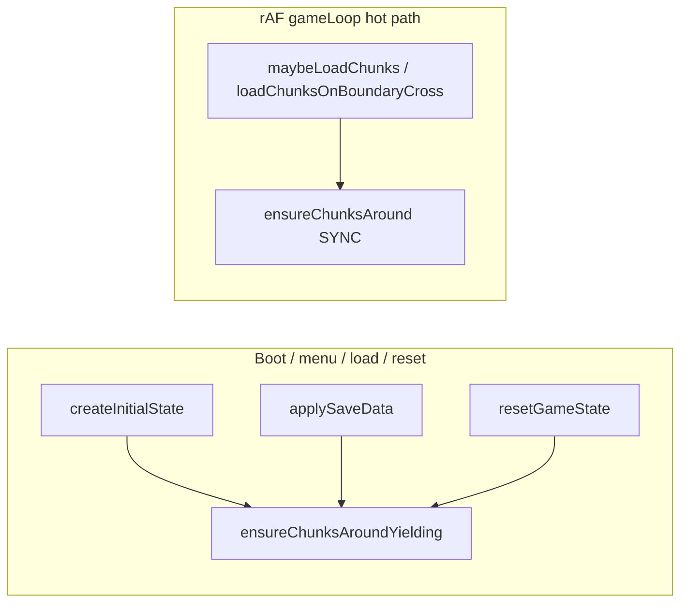
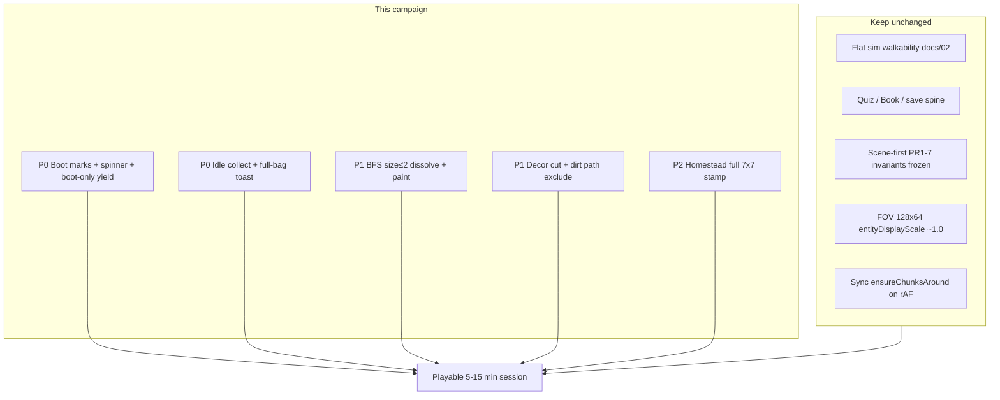

# Design: Playable-session recovery on experiment/isometric-2.0

| Field | Value |
|-------|--------|
| **Author** | (agent design pass) |
| **Date** | 2026-07-16 |
| **Status** | Draft (revision 2 — review issues addressed) |
| **Branch** | `experiment/isometric-2.0` (tip through `736f932` expandability rails) |
| **Audience** | Senior engineers + `/execute-plan` operators |
| **Supersedes expansion focus of** | `design-scene-first-productization.md` (PR1–7 **CLOSED**) |
| **Stack parent (execute-plan)** | `experiment/isometric-2.0` |

---

## Overview

Scene-first productization (PR1–7) landed gen invariants, path skeleton, functional gates, and expand rails. Manual playtest still fails the **product bar**: cold load / first frames freeze the browser, coins/verbs feel unreliable, water reads as disconnected blue tanks, and the world still looks like decorative atom soup. This campaign **does not expand scene law**. It recovers a **playable 5–15 minute session feel** with surgical fixes on the existing flat-sim + quiz/save spine.

**Success metric is live playtest**, not green tests alone. Tests stay green as a regression net; optional screenshots document water/density/homestead. Proof is: load without hang → walk → collect coins with clear feedback → read paths/water/place → optional quiz gate.

---

## Background & Motivation

### What the prior campaign claimed vs what playtest showed

| Prior claim (scene-first / definitive path) | Playtest evidence (2026-07-16) |
|---------------------------------------------|-------------------------------|
| Places + functional gates are law | Screenshot still reads as **atom soup**; house+gate composition weak |
| Path skeleton + S5 density improve readability | Paths/places still compete with decorative salt |
| V3 orphan-water polish | Water still looks like **disconnected blue tanks/channels**, not rivers |
| Core loop / M1 works | Browser hang risk on **cold load** and/or **first frames after session start** — session never starts cleanly |
| Coins + `autoCollect` exist | HUD can show ~5 coins; feel/reliability/feedback still fail product bar |

Scene-first work was **necessary but not sufficient**. Gen policy can be correct while **boot, feedback, and presentation paint** still kill the session. Expanding more scene recipes now would add content on a base that **cannot be entered or enjoyed**.

### Current boot / loop topology (relevant files)

```mermaid
sequenceDiagram
  participant Main as main.ts
  participant Init as init()
  participant LLM as waitForLlm
  participant Assets as bootstrapAssets
  participant State as createInitialState
  participant Chunks as ensureChunksAround
  participant Menu as runMenuFlow
  participant Loop as gameLoop

  Main->>Init: await init()
  Init->>LLM: await (can block long if no LLM)
  Init->>Assets: await preload tiles/SVG/book/WASM
  Init->>State: createInitialState()
  Note over State: loadGame + restore + ensureChunksAround<br/>synchronous 3×3 chunk gen (viewportBuffer=1)
  Note over State: Pre-menu cost center if hang before menu
  Init-->>Main: state, hasSaveData
  Main->>Menu: await runMenuFlow
  Note over Menu: Continue = no-op (NOT a cost center;<br/>save + chunks already applied)
  Main->>Main: bootstrapAudio (after menu)
  Main->>Loop: rAF gameLoop
  Note over Loop: Post-menu cost: first frames<br/>WU bake + incomplete SVG thrash
```

Key code paths:

| Concern | Path |
|---------|------|
| Continue UX | `src/game/menu-flow.ts` — `'continue'` is **no-op** after `init()` already loaded save. **Continue is not the gen cost center.** |
| Auto-resume restore | `src/game/state-init.ts` → `createInitialState()` → `ensureChunksAround` (**sync**, pre-menu) |
| Manual slot load | `src/game/save-apply.ts` → `applySaveData` → clear chunks + `ensureChunksAround` |
| New game reset | `src/game/game-reset.ts` → `resetGameState` → `ensureChunksAround` |
| Boundary hot path | `loadChunksOnBoundaryCross` → `ensureChunksAround` from `maybeLoadChunks` / `handleMovement` inside **sync rAF** `gameLoop` |
| Chunk gen cost | `src/game/chunk-lifecycle.ts` → `generateChunkSync` (`ChunkGenerator.ts` full phase pipeline) |
| Terrain first paint | `src/rendering/terrain-cache.ts` — per-WU lazy cache; **frustum cull already exists** (`drawCachedChunkTerrain` skips off-canvas WUs); nano water via `waterNano` + `drawNanoStack` |
| Nano SVG thrash | `src/rendering/nano-tile.ts` `loadSvgImage` — async Image decode; when `allImagesLoaded` is false the WU entry is **not stored** → **rebuild every frame** until decode completes |
| Coin collect | `src/main.ts` `handleMovement` → `autoCollect` (`mechanics.ts`) → `handleInteraction` (`interaction-handler.ts`) |
| Coin placement | `CollectibleScatterer.ts` + starter homestead breadcrumb coins |
| Decor density | `Populator.ts` `clusterDecorations` (~8–12% near origin) + Perlin flower weights in meadow; **dirt is currently eligible** for decor |
| Homestead | `starter-homestead.ts` sparse 7×7 stamp + `starter_cottage` |

### Why the session can freeze (two distinct budgets)

**Continue click itself does almost nothing** (true no-op after init). User-reported “Continue freezes” often conflates two phases:

| Phase | When | Likely cost |
|-------|------|-------------|
| **Pre-menu** | Cold load before main menu interactive | `waitForLlm`, `bootstrapAssets`, sync `ensureChunksAround` (9 chunks × full gen) |
| **Post-menu / first frames** | After Continue / New Game / Load enters `gameLoop` | Visible WU terrain bake; **incomplete water SVG → re-bake every frame** thrash |

Also: **`applySaveData` / Load slot / reset** re-run sync `ensureChunksAround` (same pre-session bulk gen pattern as init).

**Design mandate:** profile with marks before guessing; fix measured hotspots with the **PR1 acceptance ladder** (M0 marks → M1 spinner → M2 profile-justified yield/budget). Do **not** blanket-async the rAF hot path.

### Why coins feel broken despite `autoCollect`

The collect path **exists and can work** (HUD coins observed):

```ts
// mechanics.ts autoCollect — samples center + 4 footprint corners
// main.ts handleMovement — only while wantsMove === true
const collected = autoCollect(...);
if (collected?.type === 'collect') handleInteraction(collected, state);
// interaction-handler: addItem + toast + pickup_coin SFX
```

Product gaps (ordered):

1. **Hard P0 — idle early-return** — `handleMovement` returns before `autoCollect` when `!wantsMove`. Standing on a coin without holding move never collects; stop-on-cell feels “missed.”
2. **Full bag silent** — `autoCollect` does `if (!inventory.canAddItem(...)) continue` and returns `null` → **no toast**. Handler’s “Inventory full!” only runs if a collect result is produced then `addItem` fails (rare second path).
3. **Visibility** — coins on busy flower/emoji ground at FOV 128 are easy to miss (ties to density PR).
4. **Feedback already mostly OK** — default toast duration is already ~2000 ms (`ui.ts`); do **not** thrash toast timing. Coin draw scale `itemDef.scale * 0.7` may still be hard to see.
5. **Audio reorder optional** — `bootstrapAudio` runs after menu, but oscillator fallbacks cover sampled load; reorder only if playtest proves silent first collects.

### Why water looks like tanks

- Meadow Perlin weights have **no `water` key**; water arrives mainly via **WU river templates** / modular pond scenes, then `removeOrphanWater` only strips **0 same-type neighbors** (`TerrainBuilder.ts`). Pairs/triples of water still pass and read as **blue tanks**.
- Presentation paints each water base cell as a **negative-Z nano cut** into grass (`terrain-cache.ts` + `waterNano` / `inferWaterVariant`). Weak connectivity + isolated nano variants → channel/tank look, not continuous river.
- Prior V3 tests assert no true orphans; they do **not** assert river **component size** readability.
- **Wrong algorithm to avoid:** rewriting water with local degree &lt; 2 (1 neighbor). That **erodes every straight river end** and is not equivalent to small-component kill.

### Standing laws (unchanged)

From `AGENTS.md`, `docs/02` architecture principle, `definitive-path-forward-2026-07-16.md`:

1. Flat sim owns walkability/progression; presentation never decides gate open.
2. Iso2 materials are **paint only** — no new nano ontology.
3. FOV locked: on-screen diamonds **128×64**, `entityDisplayScale` ~1.0.
4. No speculative reorgs for line counts.
5. Stay on **`experiment/isometric-2.0`** — no greenfield, no daily trunk switch to `main`.

---

## Goals & Non-Goals

### Goals (player-order priority)

| Pri | Goal | Done signal |
|-----|------|-------------|
| **P0** | Cold load reaches main menu without hang; session start reaches first movable frame without hang | Two-phase manual check + boot marks under budget |
| **P0** | Coins collect reliably (incl. idle on cell) with clear feedback | Playtest: walk + stand collect; toast+SFX+HUD; full-bag not silent |
| **P1** | Water stops looking like disconnected blue tanks | Playtest/screenshot: ponds or continuous runs; no size≤2 tank soup |
| **P1** | Reduce decorative salt so paths/places can read | Spawn/explore: dirt corridors + homestead readable |
| **P2** | One homestead/gate composition that reads as a place | Spawn screenshot: house+fence+gate+clear filled yard |
| — | Keep M1 + scene-invariant suite green unless a PR intentionally tightens | CI / local Playwright subsets |

### Non-goals

- New scene recipes / expandability features (`expandability-rails.md` stays post-feel)
- New nano kinds, material factories, FOV thrash, EDGE_COMPAT rewrite
- Speculative reorgs or dual trunk with `main`
- More scene-law infrastructure for its own sake
- Perfect river hydro simulation or new world ontology for water
- **Expand short water into pond rectangles** (out of PR3; see Pillar C)
- **Await chunk gen inside `gameLoop`** without a separate written loop redesign (forbidden)
- PathSkeleton algorithm changes
- Ambient `particles.ts` overload for coin collect VFX

---

## Proposed Design

### Campaign law

> **Fix product-killing feel first.** Scene-first PR1–7 is **closed for expansion** until boot + coins + water/density pass playtest. Surgical diffs only.

### Execution base (critical for `/execute-plan`)

| Setting | Value |
|---------|--------|
| **Product tip / PR base branch / stack parent** | **`experiment/isometric-2.0`** |
| **Not** | `origin/main` (default skill base — **override**) |

Recommended operator flags:

```text
/execute-plan memories/repo/design-playable-session-recovery.md \
  --concurrency 1 \
  --no-graphite \
  --instructions "Base ALL work and stacks on experiment/isometric-2.0 (tip), NEVER origin/main. Scene-first PR1-7 is closed. P0 hang+coins before paint. Surgical only. Stack parent = experiment/isometric-2.0."
```

### Pillar A — Boot budget (P0)

**Approach: profile-then-fix** with an explicit **acceptance ladder**. Dual-path chunk API — **never** blanket-async the rAF path.

#### A.1 Instrumentation (M0 — always lands in PR1)

Add lightweight marks (console + optional `__gameDebug.bootMarks`) around:

| Mark | Location | Maps to player phase |
|------|----------|----------------------|
| `boot.llm` | `waitForLlm` | Pre-menu |
| `boot.assets` | `bootstrapAssets` | Pre-menu |
| `boot.stateInit` | `createInitialState` total | Pre-menu |
| `boot.ensureChunks` | bulk ensure (count chunks, ms) | Pre-menu / load / reset |
| `boot.chunk.N` | optional per-chunk `generateChunkSync` | Pre-menu / load |
| `boot.menuInteractive` | main menu shown and input-ready | End of pre-menu budget |
| `boot.menuToFirstFrame` | Continue/New/Load resolve → first `renderFrame` complete | Post-menu |
| `boot.terrainBake.batch` | first N terrain-cache creates / thrash count | Post-menu |
| `boot.firstMovable` | player accepted first movement input | Post-menu Done-when |

Target budgets (initial; adjust after measure):

| Phase | Soft budget (dev laptop) | Hard “hang warning” risk |
|-------|--------------------------|---------------------------|
| Pre-menu: cold load → menu interactive | &lt; 2 s after LLM ready/skip | &gt; multi-second solid task → unresponsive |
| Bulk `ensureChunks` at origin (9 chunks) | &lt; 800 ms | &gt; 2 s continuous sync |
| Post-menu: first movable frame | &lt; 1.5 s; no multi-second thrash | incomplete SVG re-bake every frame |

#### A.2 Chunk load API — boot-only yield (chosen strategy)

**Chosen: Strategy 1 — boot-only yield path.** (Strategy 2 shared queue is an alternative only if M2 profile proves boot-only insufficient for Load/reset **and** boundary crosses; not default.)

| API | Sync/async | Callers | Obligation |
|-----|------------|---------|------------|
| `ensureChunksAround(state)` | **Sync** (unchanged) | `loadChunksOnBoundaryCross` → `maybeLoadChunks` / rAF `gameLoop` | **Must stay sync.** No `await`. Hot path. |
| `ensureChunksAroundYielding(state)` or `ensureChunksAroundAsync(state): Promise<void>` | **Async** — after each `generateChunkSync`, yield (`setTimeout(0)` / microtask / idle) | **Only** boot/session orchestration: `createInitialState`, `applySaveData`, `resetGameState`, menu/load spinner paths | May show “Loading world…”; await before starting loop or enabling movement |
| Tests (`?test=1`) | Prefer **sync** ensure for determinism, or await ready flag | Playwright helpers | Wait on `__gameDebug` / boot ready |

**Forbidden without a separate loop-redesign RFC:**

- Changing `ensureChunksAround` to return `Promise<void>` for all callers
- `await` inside `gameLoop` / `handleMovement` / `maybeLoadChunks` for chunk gen
- Un-awaited fire-and-forget gen on boundary cross (player walks into missing chunks)



#### A.3 First-frame / terrain fixes (profile-justified, M2)

**Already true (do not re-implement as “new”):**

- Terrain cache is **per-WU lazy**.
- `drawCachedChunkTerrain` already **frustum-culls** WUs outside canvas before `getCachedTerrain`.

**Prioritize these real thrash fixes if profile shows post-menu hang:**

1. **Incomplete-image cache thrash** — when `allImagesLoaded` is false, entry is not stored → rebuild every frame. Fix options: store provisional entry + invalidate/re-bake on `Image.onload`; or block mark incomplete and skip full rebuild until decode; or pre-warm water variant SVGs in `bootstrapAssets` so first bake completes.
2. **Yield budget across first N WU bakes** on session start only (boot/menu path), not every boundary cross.
3. **Optional water SVG pre-warm** during `bootstrapAssets` if water nano dominates marks.

**Do not:** move gen to a Worker in this campaign; only via later RFC if profile proves irreducible.

#### A.4 Spinner / loading UX (M1)

- Show **“Loading world…”** (or existing splash) during bulk yielding ensure on cold init (if async), Load slot, New Game reset, and any post-Continue warm if M2 defers work.
- Pre-menu: menu must not appear “dead”; if init still sync, spinner during `init()` before menu is fine.
- Spinner alone does not fix a multi-second solid main-thread task — pair with M2 when hard budget exceeded.

#### A.5 PR1 acceptance ladder (minimum ship set)

| Milestone | What lands | Closes PR1 alone? |
|-----------|------------|-------------------|
| **M0** | Boot marks always | **No** — marks alone do not unhang |
| **M1** | Spinner / loading UX on resume, load-slot, reset, and cold path as needed | Only if soft budgets already met and hang was perception-only |
| **M2** | Profile-justified: boot-only yielding ensure and/or incomplete-SVG thrash fix / pre-warm / first-frame bake budget | Required if hard budget exceeded on fixed-seed laptop run |

**PR1 ship rule:** Land **M0 always**. If hard budget exceeded → must land **M1 and/or M2** (at least one real unhang). Marks-only is **not** Done.

#### A.6 Files most likely touched

- `src/game/chunk-lifecycle.ts` — add yielding API; keep sync ensure
- `src/game/state-init.ts`, `src/game/save-apply.ts`, `src/game/game-reset.ts` — call yielding API from boot/load/reset
- `src/game/menu-flow.ts`, `src/main.ts`, `src/game/new-game-flow.ts` — spinner + await yielding paths; **do not** change rAF ensure
- `src/rendering/terrain-cache.ts` — incomplete-image cache fix if profiled
- `src/rendering/nano-tile.ts` / `asset-bootstrap.ts` — optional water SVG pre-warm
- `src/game/debug-api.ts` — expose boot marks

### Pillar B — Coin reliability & feedback (P0)

#### B.1 Collect while present, not only while moving (**hard P0**)

In `handleMovement` (`main.ts`), today:

```ts
if (!wantsMove) {
  updatePlayerVisuals(...);
  resetFootstepCounter();
  return; // skips autoCollect — HARD BUG FOR FEEL
}
// ... movement ...
autoCollect(...);
```

**Required change:** always run `autoCollect` + `handleInteraction` when not paused (idle and moving). Movement remains the walk path; collect is independent.

Edge-triggered collect on stop is **not** required if per-frame idle collect stays cheap (5 cell samples).

#### B.2 Feedback package

| Channel | Priority | Change |
|---------|----------|--------|
| Idle collect | **Hard P0** | See B.1 |
| Full bag | **P0 UX** | When player occupies a coin cell and `!canAddItem('coin')`, show **rate-limited** inventory-full toast (e.g. once per 2–3 s). Do not leave silent null from `autoCollect` without feedback. Implementation: either return a distinct result type, or check occupancy + `canAddItem` at call site. |
| Toast duration | **Already OK** | Default ~2000 ms — **do not thrash** toast timing as a “fix.” |
| SFX | Baseline | Keep `pickup_coin`; oscillator fallbacks already cover sampled load. |
| Audio bootstrap order | **Optional polish** | Moving `bootstrapAudio` before menu only if playtest shows silent first collects despite oscillators. |
| HUD | Baseline | Ensure coin count refreshes same frame (already typical each frame). |
| Coin scale | Optional after density | Slightly larger coin overlay only if still invisible after PR4. |
| Collect VFX | **Optional after** toast+SFX+idle | Prefer a **tiny item-overlay scale-pop** or a one-shot pattern like existing debuff/poop burst — **not** ambient `particles.ts` overload. |

#### B.3 Placement / readability (light)

- Starter homestead breadcrumb coins — keep.
- Prefer coins on walkable base terrain (already); density PR helps visibility.

#### B.4 Tests

- Standing on coin cell without movement key still collects.
- Full bag: rate-limited full toast (or equivalent) when standing on coin.
- Existing M1 + inventory tests stay green.

### Pillar C — Water presentation (P1, paint + light gen cleanup)

Constraints: **no new water ontology**; flat sim walkability of water unchanged unless already defined in assets.

#### C.1 Gen cleanup — mandatory algorithm: BFS component size

**Normative algorithm** (replace vague “neighbor &lt; 2” thinking):

1. After all water-placing phases for the chunk have run (WU stamp, modular pond/scene, etc.), run a **single-pass** cleanup.
2. Flood-fill / BFS over 4-connected `assetKey === 'water'` **within the chunk** (chunk-local bounds; same locality as today’s `removeOrphanWater`).
3. For each component with **size ≤ 2** (default N=2; raise to 3 only after sampling tip seeds if tanks remain), rewrite those cells to majority neighboring core surface (grass default), preserving `itemId`/`npcId` if present (skip rewrite if occupied).
4. Components size ≥ 3 keep (river runs, real ponds).
5. **Pond / assembly exemption:** if modular pond or other assembly marks water intentionally, either (a) exempt cells stamped by modular scene recipes this phase, or (b) ensure ponds stamp ≥ 3 cells so they survive N=2. Prefer (b) where recipes already place multi-cell ponds; document exemption if a 1–2 cell intentional water feature exists.

**Wrong paths (non-normative — do not implement as primary):**

- Rewrite water with local degree &lt; 2 (erodes river ends).
- Multi-pass repeated end-erosion.
- **Expand short water into pond rectangles** — **out of PR3 / non-goal** for this campaign.

**Cross-chunk note:** chunk-local BFS may leave edge-biased pairs that connect across chunk borders. Accept for PR3 (same class of bias as current orphan pass). Multi-chunk BFS is **out of scope** unless residual edge tanks dominate playtest.

Keep using only existing `water` / shore `sand` assets — no new kinds.

#### C.2 Presentation connectivity

- Verify `inferWaterVariant` + neighbor water detection across chunk borders (`allChunks`).
- Prefer river-style variants for long runs; deep-pond only for true isolated basins that survive gen filter.
- Shore blend already in auto-tile — keep; do not thrash FOV.

#### C.3 Proof

- Manual explore + optional screenshot under `tests/screenshots/`.
- Gen test: sample chunks on fixed seed → count water components with size ≤ 2 is **0** (or ≈0 after known edge bias allowance).

### Pillar D — Decorative salt (P1)

Target: paths and places readable at spawn and first explore.

| Lever | File | Direction |
|-------|------|-----------|
| `clusterDecorations` coverage | `Populator.ts` | Origin (dist ≤ 2): target coverage **~4–7%** of eligible cells (down from ~8–12%). Farther chunks may taper further via existing `distFactor`. |
| Eligible cells | `Populator.ts` | **Explicit rule:** decoration-eligible base excludes **path corridor dirt**. Implementation: do not place decor on `assetKey === 'dirt'` when that dirt is path-skeleton / corridor (if flagged), **or simply exclude all `dirt` from decor eligible** and leave dirt for paths/yards only (simplest surgical rule). Grass/sand remain eligible. |
| Meadow Perlin flowers/animals | `biomes.config.ts` | Cut flower/plant terrain salt (currently flower+variants+tulip/clover/wheat/sunflower ≈ 0.16 combined) toward a lower band (e.g. total flower-family ≤ ~0.08) so grass dominates. |
| Path skeleton | `PathSkeleton.ts` | **Algorithm untouched.** Density PR only filters population after paths exist. |
| Obstacles | biome `obstacleWeights` | Keep trees/bushes; do not bury gates. |

Preserve: quiz gates, coins on trails, farm/modular scenes.

**Numeric acceptance (origin chunk, fixed tip seed):** decoration-bearing walkable cells (flowers/emoji salt, not structures) ≤ ~7% of walkable base after PR4, or playtest “paths obvious” wins if seed variance fights exact %.

### Pillar E — Homestead place readability (P2)

Surgical edits to `starter-homestead.ts` only (+ paint only if needed):

**Fill policy (normative):**

1. Every cell in the 7×7 footprint offsets `[0..6]×[0..6]` is **explicitly stamped** (no unstamped WU residue gaps).
2. **Interior default:** grass and/or dirt yard pattern for cells that are not structures, fence, openings, or authored props.
3. **Structure cells unchanged in role:** fence ring, `starter_cottage`, stone floors, sign, campfire, south `quiz_gate` + dirt flanks as today.
4. **Openings contract unchanged:** `STARTER_HOMESTEAD_OPENINGS` + `repairSceneOpenings` stay law.
5. `ensureSpawnClearance` remains **last** on chunk (0,0).
6. Optional: lengthen dirt approach by 1 cell for gate contrast — only if fill already complete and playtest wants stronger exit read.
7. **No** catalog-wide new recipes; **no** new nano kinds.

**Proof:** optional screenshot compare to `tests/screenshots/proof-scene-law-spawn.png`.

### Architecture diagram (post-recovery priorities)



---

## API / Interface Changes

| Change | API impact |
|--------|------------|
| `ensureChunksAround(state)` | **Unchanged sync** — rAF / boundary callers |
| `ensureChunksAroundYielding` / `ensureChunksAroundAsync` | **New** — boot/load/reset only; returns `Promise<void>` |
| Boot marks | Module-level or `__gameDebug.getBootMarks()` for debug/tests |
| `autoCollect` idle | No signature change required; call-site always runs collect |
| Full-bag feedback | Optional new result type **or** call-site occupancy check — either OK |
| Water cleanup | Internal gen helper `dissolveSmallWaterComponents(cells, size, maxSize=2)`; export for tests optional |

### Caller matrix (chunk ensure)

| Caller | File | Sync ensure | Yielding ensure |
|--------|------|-------------|-----------------|
| `createInitialState` | `state-init.ts` | no (prefer yielding) | **yes** |
| `applySaveData` | `save-apply.ts` | no (prefer yielding) | **yes** |
| `resetGameState` | `game-reset.ts` | no (prefer yielding) | **yes** |
| `loadChunksOnBoundaryCross` | `chunk-lifecycle.ts` | **yes** | **no** |
| `maybeLoadChunks` | `main.ts` | via boundary cross | **no** |
| Direct tests | various | **yes** preferred | optional await |

No SaveData schema migration. No inventory API change required unless distinct full-bag result type is chosen.

---

## Data Model Changes

None planned. Cells remain `assetKey` + `walkable` + optional `itemId`. Water remains `water` asset. Resolved cells / save format unchanged.

---

## Alternatives Considered

### 1. Greenfield or switch daily trunk to `main`

| Pros | Cons |
|------|------|
| Main has simpler FOV history | Re-buy M1, quiz, save, content, scene-first — months |
| | Does not fix hang on this tip |
| | Explicitly rejected by definitive-path + AGENTS.md |

**Decision:** Reject.

### 2. More scene recipes / expandability work now

| Pros | Cons |
|------|------|
| More “places” content | Player cannot start session if hang persists |
| | Coins/water/density still fail feel |
| | Campaign overclaim already showed gen law ≠ playable feel |

**Decision:** Reject until P0/P1 feel fixed.

### 3. Full Worker-based world gen + render rewrite

| Pros | Cons |
|------|------|
| Would eliminate main-thread gen stalls | Large architecture; speculative; high regression risk |
| | Violates “surgical” and freeze Iso2 architecture |

**Decision:** Reject for this campaign.

### 4. Presentation-only water (no gen change)

| Pros | Cons |
|------|------|
| Pure paint | Cannot fix true 1–2 cell water tanks in sim grid |
| | Tank silhouettes remain |

**Decision:** Prefer **BFS size≤2 dissolve + paint connectivity** (hybrid), no new ontology.

### 5. Blanket-async `ensureChunksAround` for all callers

| Pros | Cons |
|------|------|
| One API | Forces await-in-loop or un-awaited races on boundary cross |
| | High softlock risk |

**Decision:** Reject. Use **boot-only yielding API** (Pillar A.2).

### 6. Degree &lt; 2 water rewrite

| Pros | Cons |
|------|------|
| Simple | Erodes river ends; not equivalent to component size |

**Decision:** Reject as normative algorithm.

### 7. Do nothing on coins; only document `autoCollect`

| Pros | Cons |
|------|------|
| Zero code | Product bar fails |

**Decision:** Reject.

---

## Risks & Mitigations

| Risk | Sev | Mitigation |
|------|-----|------------|
| Yielding boot races if loop starts early | High | Await yielding ensure before rAF / gate movement until buffer ready |
| Engineer awaits in gameLoop | High | Explicit forbid + caller matrix; code review |
| Yield changes flaky Playwright timings | Med | Test mode uses sync ensure or waits on ready flag |
| Lower density breaks population specs | Med | Tune 4–7% / flower weights; re-run population, path-skeleton, M1 |
| BFS size≤2 dissolves intentional tiny water | Med | Ensure modular ponds ≥ 3 cells or explicit assembly exemption |
| Chunk-local BFS leaves border pairs | Low | Accept PR3; playtest edge tanks; multi-chunk out of scope |
| Homestead fill breaks spawn clearance | Med | Keep `ensureSpawnClearance` last; re-run spawn-escape + M1 |
| Incomplete SVG thrash missed while “optimizing cull” | Med | Document existing frustum cull; fix cache-on-incomplete |
| Over-scoping into nano architecture | High | PR review: paint-only; no new kinds |
| execute-plan branches from `main` | High | Stack parent = `experiment/isometric-2.0`; operator `--instructions` |

---

## Observability / How we prove boot is fixed

1. **Boot marks** logged once per session: `console.info('[BOOT]', marks)` covering **pre-menu** and **post-menu** phases.
2. **Manual proof (two checks):**
   - **(1)** Cold load → main menu interactive without “Page Unresponsive.”
   - **(2)** Continue / New Game / Load → first movable frame without “Page Unresponsive.”
3. **Optional automated:** Playwright measures time to menu and time to `frameCount >= 1` under a generous CI ceiling (e.g. 5 s each) — non-flaky ceiling, not laptop soft budget.
4. **Bug report path** (`bug-report.ts`) if hang is intermittent.
5. Coins: inventory delta + toast; full-bag rate-limited toast.

---

## Security & Privacy Considerations

- Save data remains localStorage; no new network surface.
- Boot marks must not log full save payloads or PII.
- LLM gate behavior unchanged (still optional skip in dev).

---

## Rollout / Playtest Plan

1. Land PR1 (boot ladder M0–M2 as needed) on `experiment/isometric-2.0`; playtest **cold load→menu** and **Continue/New/Load→move**.
2. Land PR2 (coins); playtest idle collect + full bag + homestead coins.
3. Land PR3–4 (water BFS, density); screenshot spawn/explore.
4. Land PR5 (homestead fill); spawn screenshot vs `proof-scene-law-spawn.png`.
5. Full regression:  
   `npx playwright test tests/gameplay/playability-m1-core-loop.spec.ts tests/world-gen/scene-invariants.spec.ts tests/world-gen/ban-free-structure-atoms.spec.ts tests/world-gen/path-skeleton.spec.ts tests/world-gen/gen-determinism.spec.ts tests/gameplay/save-resume-parity.spec.ts`
6. Update `AGENTS.md` campaign status when recovery completes.

**Rollback:** each PR independently revertable; no schema migration.

---

## Open Questions

None blocking design. Measurement-only inside PR1:

- Exact yield primitive (`setTimeout(0)` vs rAF vs idle) for boot-only path — pick after first profile.
- Whether incomplete-SVG thrash or bulk gen dominates post-menu — marks decide M2 tactic.

Water N=2 is the default; raise to 3 only if sampling shows residual tanks without river damage.

---

## Key Decisions

1. **Product tip / stack parent stays `experiment/isometric-2.0`.** All `/execute-plan` work bases here, **not** `origin/main`.
2. **Scene-first PR1–7 is CLOSED** for expansion until feel recovery passes playtest.
3. **Success = playtest**, not tests alone; keep M1/scene suites green.
4. **P0 order:** boot hang (two-phase) → coin idle collect/full-bag → then water → density → homestead.
5. **Boot-only yielding chunk API**; **sync `ensureChunksAround` remains** for rAF boundary crosses. **Forbid await-in-gameLoop** without loop redesign RFC.
6. **PR1 ladder:** M0 marks always → M1 spinner → M2 profile-justified unhang; marks alone do not close PR1 if hard budget exceeded.
7. **Coins:** idle collect is hard P0; full-bag rate-limited toast; toast duration already OK; audio reorder optional; VFX optional overlay pop only.
8. **Water:** mandatory BFS/flood-fill dissolve components **size ≤ 2**, single-pass, chunk-local; **not** degree &lt; 2; **no** expand-to-pond-rectangle.
9. **Density:** origin decor ~4–7%; exclude path/dirt corridor from decor eligible; PathSkeleton untouched.
10. **Homestead:** stamp every cell of 7×7; interior grass/dirt; structures + openings unchanged.
11. **Terrain thrash:** respect existing frustum cull; fix incomplete-image re-bake / pre-warm.
12. **Iso2 / FOV / flat sim laws frozen** as in AGENTS.md.
13. **PR Plan = 5 PRs**, each with player Done-when + test commands.
14. **Surgical diffs only** — no speculative reorgs.

---

## References

- `AGENTS.md` — campaign memory; branch law; scene-first status
- `memories/repo/definitive-path-forward-2026-07-16.md` — why this branch
- `memories/repo/design-scene-first-productization.md` — closed PR1–7 design
- `memories/repo/expandability-rails.md` — post-recovery growth only
- `memories/repo/code-organization-philosophy.md` — no reorg for aesthetics
- `docs/01` / `docs/02-Architecture-Core-Principle.md` — vision + flat sim
- Code: `src/main.ts`, `src/game/menu-flow.ts`, `src/game/state-init.ts`, `src/game/save-apply.ts`, `src/game/game-reset.ts`, `src/game/chunk-lifecycle.ts`, `src/engine/mechanics.ts`, `src/game/interaction-handler.ts`, `src/engine/world/ChunkGenerator.ts`, `src/engine/world/TerrainBuilder.ts`, `src/engine/world/Populator.ts`, `src/engine/world/CollectibleScatterer.ts`, `src/rendering/terrain-cache.ts`, `src/rendering/nano-tile.ts`, `src/engine/iso2-assemblies/starter-homestead.ts`
- Playtest artifact: `tests/screenshots/Screenshot 2026-07-16 113606.png`
- Prior visual refs: `tests/screenshots/proof-scene-law-spawn.png`, `visual-s5-density-spawn.png`

---

## PR Plan

> **Base branch / stack parent for every PR: `experiment/isometric-2.0` (current tip), NOT `origin/main`.**  
> Prefer `--concurrency 1` for P0. Do not open scene-recipe expansion PRs in this plan.

### PR 1: Boot budget — marks + unhang (two-phase)

- **Description:** Land M0 boot marks (pre-menu + post-menu). Land M1 spinner/loading UX on bulk load paths. If hard budget exceeded on a fixed-seed laptop run, land M2: **boot-only** `ensureChunksAroundYielding` for `createInitialState` / `applySaveData` / `resetGameState`, and/or incomplete water-SVG cache thrash fix / optional SVG pre-warm. **Keep sync `ensureChunksAround` for rAF boundary crosses.** Do not await chunk gen in `gameLoop`.
- **Files/components affected:** `src/game/chunk-lifecycle.ts`, `src/game/state-init.ts`, `src/game/save-apply.ts`, `src/game/game-reset.ts`, `src/game/menu-flow.ts`, `src/main.ts`, `src/game/new-game-flow.ts`, possibly `src/rendering/terrain-cache.ts`, `src/game/asset-bootstrap.ts`, `src/game/debug-api.ts`.
- **Dependencies:** None
- **Stack parent:** `experiment/isometric-2.0`
- **Done-when (player):**
  1. **Cold load → main menu** interactive without browser “Page Unresponsive” / kill-page prompt.
  2. **Continue / New Game / Load → first movable frame** without unresponsive dialog (spinner OK; frozen tab not OK).
  3. Note: Continue click is **not** the gen cost center; it must still feel instant or briefly spun, not hung.
- **Test/check commands:**
  - Manual: cold load → menu; Continue; New Game; Load slot.
  - `npx playwright test tests/gameplay/save-resume-parity.spec.ts tests/gameplay/playability-m1-core-loop.spec.ts tests/gameplay/spawn-escape-hatch.spec.ts`
  - Confirm `[BOOT]` marks print; Performance panel: no multi-second solid main-thread task for pre-menu or menu→first move after M2 if needed.

### PR 2: Coin collect reliability + feedback

- **Description:** Run `autoCollect` while idle on a coin cell (**hard P0**). Full-bag: rate-limited inventory-full toast when standing on coin and bag full. Do not thrash toast duration (already ~2s). Audio bootstrap reorder only if playtest needs it. Optional collect VFX = tiny overlay pop only, not ambient particles.
- **Files/components affected:** `src/main.ts` (`handleMovement`), possibly `src/engine/mechanics.ts`, `src/game/interaction-handler.ts`; optional `src/main.ts` audio order; optional item overlay pop in render path.
- **Dependencies:** PR 1
- **Stack parent:** `experiment/isometric-2.0`
- **Done-when (player):** Walking over coins always increments HUD; **standing still on a coin collects**; toast + coin SFX on success; full bag shows a clear rate-limited message (not silent); starter breadcrumb coins teach the verb in the first 30 seconds.
- **Test/check commands:**
  - Manual: New Game → walk + stop on homestead coins; full bag check if feasible.
  - `npx playwright test tests/gameplay/playability-m1-core-loop.spec.ts tests/core/game.spec.ts`
  - Optional E2E: force position on coin, no keys, assert inventory.

### PR 3: Water — BFS size≤2 dissolve + connectivity paint

- **Description:** Single-pass **BFS/flood-fill** dissolve of water components with **size ≤ 2** (chunk-local). Drop degree&lt;2 as algorithm. No expand-to-pond-rectangle. Fix presentation connectivity/variants for remaining water. No new nano kinds; FOV unchanged.
- **Files/components affected:** `src/engine/world/TerrainBuilder.ts` (replace/extend `removeOrphanWater` or companion `dissolveSmallWaterComponents`), `ChunkGenerator.ts` call site if needed, `src/rendering/terrain-cache.ts` (`inferWaterVariant`), tests under `tests/world-gen/v3-water-roof-polish.spec.ts` or sibling.
- **Dependencies:** PR 1; stack after P0 feel (after or parallel PR2 if concurrency=2)
- **Stack parent:** `experiment/isometric-2.0`
- **Done-when (player):** Early chunks show water as **ponds or continuous runs**, not scattered 1–2 cell blue tanks.
- **Test/check commands:**
  - Manual screenshot spawn + explore near water.
  - `npx playwright test tests/world-gen/v3-water-roof-polish.spec.ts tests/world-gen/water-bridge.spec.ts tests/world-gen/gen-determinism.spec.ts`
  - Assert sample chunks: water components with size ≤ 2 are 0 (allow documented edge bias if needed).

### PR 4: Decorative density cut for path/place readability

- **Description:** Origin decor coverage ~4–7%; **exclude dirt path/corridor cells from decor eligible** (simplest: exclude `dirt` from decor base). Cut meadow flower-family Perlin salt. **Do not change PathSkeleton algorithm.** Preserve gates and coin trails.
- **Files/components affected:** `src/engine/world/Populator.ts` (`clusterDecorations` eligible filter + coverage), `src/config/biomes.config.ts`.
- **Dependencies:** PR 1; best after PR 3
- **Stack parent:** `experiment/isometric-2.0`
- **Done-when (player):** At spawn and first explore, **dirt paths and structures are obvious**; ground is not a flower/emoji carpet.
- **Test/check commands:**
  - Manual: spawn + explore vs `Screenshot 2026-07-16 113606.png`.
  - `npx playwright test tests/world-gen/path-skeleton.spec.ts tests/world-gen/population.spec.ts tests/world-gen/scene-invariants.spec.ts tests/world-gen/ban-free-structure-atoms.spec.ts`

### PR 5: Homestead composition that reads as a place

- **Description:** Stamp **every** cell of the 7×7 homestead; interior grass/dirt yard; keep structure roles, openings contract, and `ensureSpawnClearance` last. No catalog recipes.
- **Files/components affected:** `src/engine/iso2-assemblies/starter-homestead.ts`; M1 / spawn tests.
- **Dependencies:** PR 1; ideally after PR 4
- **Stack parent:** `experiment/isometric-2.0`
- **Done-when (player):** Spawn reads as **a fenced home with a gate and clear yard**, not a cottage emoji in residue clutter. South quiz gate remains the exit teacher. Optional compare to `proof-scene-law-spawn.png`.
- **Test/check commands:**
  - Manual spawn screenshot.
  - `npx playwright test tests/gameplay/playability-m1-core-loop.spec.ts tests/world-gen/scene-invariants.spec.ts tests/gameplay/spawn-escape-hatch.spec.ts tests/rendering/iso2-e-spawn-clearance-fix.spec.ts`

---

### PR Plan DAG

```text
PR1 (boot P0 — M0/M1/M2 ladder)
 ├── PR2 (coins P0 — idle collect)
 ├── PR3 (water P1 — BFS size≤2)
 │    └── PR4 (density P1)
 │         └── PR5 (homestead P2)
 └── (PR3 ∥ PR2 allowed after PR1 if concurrency=2; prefer coins before paint)
```

**Recommended serial order:** PR1 → PR2 → PR3 → PR4 → PR5.

**Campaign complete when:** PR1–5 Done-when player criteria all pass on `experiment/isometric-2.0` tip + listed regression commands green.
